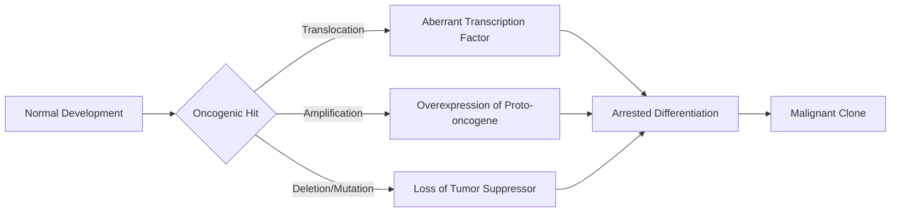
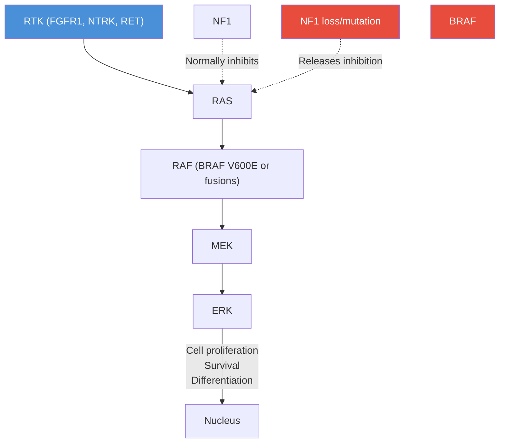

# Pediatric Tumors: Comprehensive Overview

Pediatric malignancies represent a biologically distinct group of cancers that differ fundamentally from their adult counterparts in their embryological origins, molecular drivers, treatment responses, and long-term outcomes. Understanding these differences is crucial for the development of effective therapies that balance cure with minimization of late effects.

---

## Table of Contents

1. [Epidemiology](#epidemiology)
2. [Developmental Biology and Oncogenesis](#developmental-biology-and-oncogenesis)
3. [Molecular Landscape](#molecular-landscape)
4. [Cancer Predisposition Syndromes](#cancer-predisposition-syndromes)
5. [General Treatment Principles](#general-treatment-principles)
6. [Subcategories](#subcategories)
7. [References](#references)

---

## Epidemiology

Pediatric cancers account for approximately **400,000 new cases per year** worldwide (children 0-19 years), representing ~1% of all cancer diagnoses globally. However, cancer is the **leading cause of disease-related death** in children in high-income countries, after accidents.

### Global Incidence by Region

| Region | Estimated Incidence (per million, 0-14y) | 5-Year Survival |
|--------|------------------------------------------|-----------------|
| High-Income Countries | 140-170 | ~85% |
| Middle-Income Countries | 100-130 | ~50-70% |
| Low-Income Countries | 80-100 | ~20-40% |

> Data from GLOBOCAN 2020 and IARC Childhood Cancer International (CCI)

### Distribution by Cancer Type

The distribution of pediatric cancers differs markedly from adults:

```
Pediatric Cancer Distribution (0-14 years):
┌─────────────────────────────────────────────────────────┐
│ Leukemia                          ████████████  30-35%  │
│ CNS Tumors                        █████████     25-27%  │
│ Lymphomas                         ████          10-12%  │
│ Neuroblastoma                     ███            7-8%   │
│ Wilms Tumor (Nephroblastoma)      ███            6-7%   │
│ Bone Tumors                       ██             4-5%   │
│ Soft Tissue Sarcomas              ██             4-5%   │
│ Retinoblastoma                    █              3%     │
│ Germ Cell Tumors                  █              3%     │
│ Other                             ██             4-6%   │
└─────────────────────────────────────────────────────────┘
```

### Age-Specific Patterns

Different cancers show characteristic age peaks reflecting their embryological origins:

| Age Group | Predominant Tumors |
|-----------|--------------------|
| 0-4 years | Neuroblastoma, Wilms tumor, Retinoblastoma, Hepatoblastoma, Infant ALL |
| 5-9 years | ALL (peak), CNS tumors (medulloblastoma), Ewing sarcoma |
| 10-14 years | ALL, CNS tumors, Osteosarcoma, Hodgkin Lymphoma |
| 15-19 years | Hodgkin Lymphoma, Osteosarcoma, Thyroid carcinoma, Testicular GCT |

---

## Developmental Biology and Oncogenesis

### Why Pediatric Cancers Are Biologically Different

Pediatric tumors arise from **progenitor cells undergoing normal developmental processes** — proliferation, differentiation, and migration. This is fundamentally different from adult cancers, which arise from accumulated mutations in terminally differentiated cells.

**Key differences:**

| Feature | Pediatric Cancers | Adult Cancers |
|---------|-------------------|---------------|
| Cell of origin | Embryonic/progenitor cells | Differentiated somatic cells |
| Mutation burden | Low (1-10 mutations/Mb) | High (1-100+ mutations/Mb) |
| Driver alterations | Often single, early events | Multiple accumulated mutations |
| Epigenetic dysregulation | Very prominent | Variable |
| Hereditary predisposition | ~10-15% | ~5-10% |
| Environmental exposures | Rarely causal | Often significant |
| Immune microenvironment | Often "cold" | More variable |

### The Role of Developmental Transcription Factors

Many pediatric cancers are driven by dysregulation of transcription factors critical for normal development:



---

## Molecular Landscape

### Common Molecular Alterations in Pediatric Cancers

The molecular landscape of pediatric cancers is characterized by:

#### 1. Fusion Oncogenes
Chromosomal translocations creating novel fusion proteins are hallmark events in many pediatric cancers:

| Fusion | Cancer | Mechanism |
|--------|--------|-----------|
| ETV6-RUNX1 (TEL-AML1) | B-ALL | Transcriptional repression |
| BCR-ABL1 | Ph+ ALL, CML | Constitutive kinase activation |
| RUNX1-RUNX1T1 (AML1-ETO) | AML t(8;21) | Transcriptional repression |
| PML-RARA | APL t(15;17) | Retinoic acid receptor fusion |
| NPM-ALK | ALCL | Constitutive ALK kinase |
| EWS-FLI1 | Ewing sarcoma | Aberrant transcription factor |
| PAX3/7-FOXO1 | Alveolar RMS | Aberrant transcription factor |
| C11orf95-RELA | Ependymoma | NF-κB activation |
| BRAF-KIAA1549 | Low-grade glioma | MAPK activation |

#### 2. Epigenetic Drivers
Pediatric cancers show a remarkable enrichment of mutations in epigenetic regulators:

| Gene | Type | Cancers Affected | Function |
|------|------|------------------|----------|
| H3F3A (H3.3K27M) | Histone mutation | DIPG, DMG | PRC2 inhibition, H3K27me3 loss |
| H3F3A (H3.3G34R/V) | Histone mutation | HGG, GIST | SETD2 interference |
| SMARCB1 (INI1) | SWI/SNF loss | AT/RT, RTMR | Chromatin remodeling |
| KMT2A (MLL) | Histone methyltransferase | ALL, AML | H3K4me3 regulation |
| DNMT3A | DNA methyltransferase | AML | DNA methylation |
| ATRX | Chromatin remodeler | HGG | ALT mechanism |
| EZHIP | PRC2 inhibitor | Ependymoma PFA | H3K27me3 loss |

#### 3. Signal Transduction Pathway Alterations

The MAPK (RAS-RAF-MEK-ERK) pathway is the most commonly activated pathway in pediatric solid tumors:



---

## Cancer Predisposition Syndromes

Approximately **10-15% of pediatric cancers** occur in the context of a hereditary predisposition syndrome:

| Syndrome | Gene(s) | Associated Tumors |
|----------|---------|-------------------|
| Li-Fraumeni Syndrome | TP53 | Sarcomas, HGG (SHH-MB), adrenocortical |
| Neurofibromatosis Type 1 | NF1 | Low-grade glioma, MPNST, JMML |
| Neurofibromatosis Type 2 | NF2 | Meningioma, ependymoma, schwannoma |
| DICER1 Syndrome | DICER1 | Pleuropulmonary blastoma, ovarian SCST |
| Constitutional Mismatch Repair Deficiency (CMMRD) | MLH1, MSH2, MSH6, PMS2 | Glioblastoma, T-ALL, colon cancer |
| Down Syndrome | Trisomy 21 | DS-ALL, DS-AML (GATA1 mutations) |
| Gorlin Syndrome | PTCH1 | SHH Medulloblastoma, basal cell |
| Fanconi Anemia | FANCA-FANCU | AML, MDS, squamous cell |
| Ataxia-Telangiectasia | ATM | ALL, lymphoma |
| Beckwith-Wiedemann | IGF2/H19 | Wilms, hepatoblastoma |
| RB1 germline | RB1 | Retinoblastoma, osteosarcoma |
| VHL Syndrome | VHL | CNS hemangioblastoma, clear cell RCC |
| Gorlin/Basal Cell Nevus | PTCH1 | Medulloblastoma (SHH), BCC |
| Rhabdoid Predisposition | SMARCB1, SMARCA4 | AT/RT, rhabdoid tumors |

> Genetic counseling and germline testing should be offered to all pediatric cancer patients. Current NCCN and SIOPE guidelines recommend panel-based germline testing.

---

## General Treatment Principles

### Multimodality Therapy

Pediatric cancer treatment is delivered through **cooperative group clinical trials** and relies on multimodality approaches:

```
TREATMENT FRAMEWORK
┌─────────────────────────────────────────────────────────┐
│                   DIAGNOSIS                             │
│                       │                                 │
│        ┌──────────────┼──────────────┐                  │
│        │              │              │                  │
│    SURGERY         RADIATION     SYSTEMIC               │
│   - Biopsy         - Photon       THERAPY               │
│   - Resection      - Proton      - Chemotherapy         │
│   - Debulking      - IMRT        - Targeted therapy     │
│   - Shunt          - SRS/SRT     - Immunotherapy        │
│        │              │          - SCT                  │
│        └──────────────┼──────────┘                      │
│                   RESPONSE                              │
│                ASSESSMENT (MRD)                         │
│                       │                                 │
│          ┌────────────┴────────────┐                    │
│     COMPLETE                  REFRACTORY/               │
│     REMISSION                  RELAPSE                  │
│          │                        │                     │
│    MAINTENANCE              SALVAGE / CLINICAL TRIAL    │
└─────────────────────────────────────────────────────────┘
```

### Risk Stratification

Modern pediatric oncology employs **risk-adapted therapy** to balance cure rates with long-term toxicity:

| Risk Group | Definition | Approach |
|------------|------------|----------|
| Low Risk | Favorable biology, minimal residual disease negative | Reduced intensity; avoid radiation |
| Standard Risk | Average features | Standard protocols |
| High Risk | Unfavorable molecular markers, poor early response | Intensified therapy, SCT consideration |
| Very High Risk | Specific adverse features | Investigational, phase I/II |

### Late Effects

A critical consideration in pediatric oncology — given that ~85% of children in high-income countries become long-term survivors:

| Treatment | Common Late Effects |
|-----------|---------------------|
| Cranial radiation | Neurocognitive deficits, endocrine dysfunction, secondary tumors |
| Anthracyclines | Cardiomyopathy |
| Alkylating agents | Infertility, secondary malignancy |
| Cisplatin | Hearing loss, nephrotoxicity |
| Vincristine | Peripheral neuropathy |
| Corticosteroids | Osteoporosis, obesity, metabolic syndrome |
| Stem cell transplant | Graft-versus-host, infections, secondary malignancy |

> The Children's Oncology Group (COG) Long-Term Follow-Up Guidelines provide evidence-based surveillance recommendations for all pediatric cancer survivors.

---

## Subcategories

This wiki covers two major categories of pediatric tumors in detail:

### [Pediatric Brain Tumors](10a-pediatric-brain-tumors.md)
Central nervous system tumors are the **most common solid tumors** in children and the leading cause of cancer-related mortality in pediatric patients. Coverage includes:
- Medulloblastoma (WNT, SHH, Group 3, Group 4)
- Diffuse Intrinsic Pontine Glioma (DIPG) / Diffuse Midline Glioma H3K27-altered
- Pediatric Low-Grade Gliomas (PLGG)
- Ependymoma
- Atypical Teratoid/Rhabdoid Tumor (AT/RT)
- Craniopharyngioma
- Other CNS entities

### [Pediatric Hematological Tumors](10b-pediatric-hematological-tumors.md)
Leukemias and lymphomas are the **most common pediatric malignancies** overall. Coverage includes:
- Acute Lymphoblastic Leukemia (ALL) — B-ALL and T-ALL
- Acute Myeloid Leukemia (AML)
- Juvenile Myelomonocytic Leukemia (JMML)
- Hodgkin Lymphoma
- Non-Hodgkin Lymphoma (Burkitt, ALCL, DLBCL, Lymphoblastic)

---

## References

1. Steliarova-Foucher E, et al. (2017). International incidence of childhood cancer, 2001–10: a population-based registry study. *Lancet Oncology*, 18(6), 719-731. DOI: 10.1016/S1470-2045(17)30186-9

2. Ward E, et al. (2014). Childhood and Adolescent Cancer Statistics, 2014. *CA: A Cancer Journal for Clinicians*, 64(2), 83-103. DOI: 10.3322/caac.21219

3. Bhakta N, et al. (2019). The cumulative burden of surviving childhood cancer: an initial report from the St Jude Lifetime Cohort Study. *Lancet Oncology*, 18(12), 1607-1617. DOI: 10.1016/S1470-2045(17)30788-X

4. Gröbner SN, et al.; PCAWG Consortium (2018). The landscape of genomic alterations across childhood cancers. *Nature*, 555, 321-327. DOI: 10.1038/nature25480

5. Ma X, et al. (2018). Pan-cancer genome and transcriptome analyses of 1,699 paediatric leukaemias and solid tumours. *Nature*, 555, 371-376. DOI: 10.1038/nature25795

6. Zhang J, et al. (2015). Germline mutations in predisposition genes in pediatric cancer. *New England Journal of Medicine*, 373(24), 2336-2346. DOI: 10.1056/NEJMoa1508054

7. Howlader N, et al. SEER Cancer Statistics Review, 1975-2016. National Cancer Institute. Bethesda, MD.

8. Childhood Cancer International (CCI). International Childhood Cancer Day Reports. www.cchildhoodcancerinternational.org

9. Children's Oncology Group (COG) Long-Term Follow-Up Guidelines. Version 5.0. 2018. www.survivorshipguidelines.org
