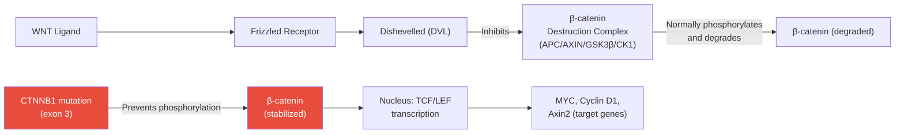
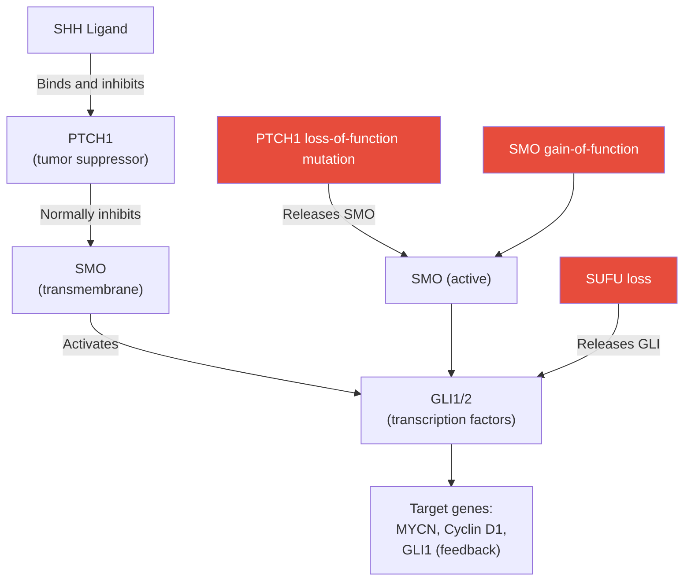
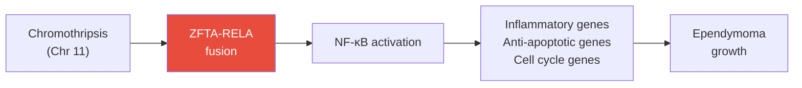
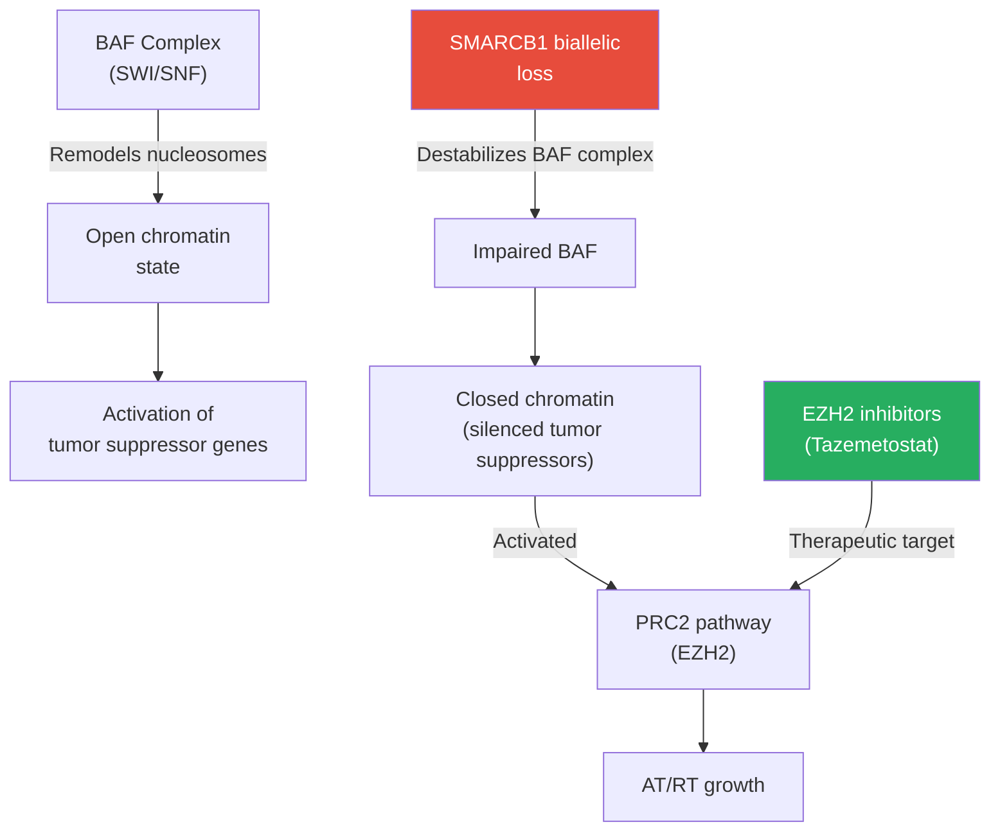

# Pediatric Brain Tumors

Central nervous system (CNS) tumors are the **most common solid malignancy in children**, representing ~25% of all pediatric cancers and the **leading cause of cancer-related mortality** in children beyond infancy. The 2021 WHO Classification of CNS Tumors introduced major changes incorporating molecular markers as defining features, fundamentally shifting how these tumors are classified and treated.

> **Parent Page**: [Pediatric Tumors Overview](10-pediatric-tumors.md)

---

## Table of Contents

1. [Epidemiology and Overview](#epidemiology-and-overview)
2. [WHO 2021 CNS Classification](#who-2021-cns-classification)
3. [Medulloblastoma](#medulloblastoma)
4. [Diffuse Midline Glioma / DIPG](#diffuse-midline-glioma--dipg)
5. [Pediatric-Type Diffuse High-Grade Glioma](#pediatric-type-diffuse-high-grade-glioma)
6. [Pediatric Low-Grade Glioma](#pediatric-low-grade-glioma)
7. [Ependymoma](#ependymoma)
8. [Atypical Teratoid/Rhabdoid Tumor (AT/RT)](#atypical-teratoidrhabdoid-tumor-atrt)
9. [Craniopharyngioma](#craniopharyngioma)
10. [Embryonal Tumor with Multilayered Rosettes (ETMR)](#embryonal-tumor-with-multilayered-rosettes-etmr)
11. [Diagnostic Approach](#diagnostic-approach)
12. [Treatment Modalities](#treatment-modalities)
13. [Emerging Therapies and Clinical Trials](#emerging-therapies-and-clinical-trials)
14. [References](#references)

---

## Epidemiology and Overview

### Incidence

- ~5 per 100,000 children per year in high-income countries
- Slight male predominance (M:F ≈ 1.2:1)
- ~4,000 new cases/year in the United States (ages 0-19)
- Brain tumors are the #1 cause of cancer death in children 1-14 years

### Anatomical Distribution

Pediatric brain tumors have a characteristic **infratentorial predominance** in contrast to adults:

```
Anatomical Distribution by Age:
┌─────────────────────────────────────────────────────────┐
│ Children (0-14y):                                        │
│   Infratentorial (posterior fossa):  ████████   ~55%   │
│   Supratentorial:                    ██████      ~40%   │
│   Spinal:                            █            ~5%   │
│                                                          │
│ Adults:                                                  │
│   Infratentorial:                    ██           ~20%  │
│   Supratentorial:                    ████████     ~75%  │
│   Spinal:                            █             ~5%  │
└─────────────────────────────────────────────────────────┘
```

### 5-Year Survival Rates by Tumor Type

| Tumor Type | 5-Year Overall Survival |
|------------|------------------------|
| Medulloblastoma (WNT) | >95% |
| Medulloblastoma (SHH, TP53 WT) | ~75-80% |
| Medulloblastoma (Group 3) | ~50-60% |
| Medulloblastoma (Group 4) | ~65-75% |
| DIPG/H3K27M DMG | <10% (median OS 9-12 mo) |
| Pediatric LGG | >90% (10-year) |
| Ependymoma | ~65-75% |
| AT/RT | ~30-40% (older patients) |
| Craniopharyngioma | >90% (OS), high morbidity |

---

## WHO 2021 CNS Classification

The 2021 WHO Classification of Tumors of the Central Nervous System (5th edition) introduced **molecular-integrated diagnosis** as standard of care. Key principles:

### Major Changes from 2016

1. **Molecular markers are now defining**: A tumor's name is determined first by molecular features, then histology
2. **Pediatric-specific entities introduced**: Pediatric diffuse low-grade gliomas, pediatric diffuse high-grade gliomas are now separate from adult counterparts
3. **New grading approach**: "CNS WHO Grade" within tumor type (not across types)
4. **Many new entities**: ~22 new tumor types added

### Pediatric CNS Tumor Classification (2021 WHO)

```
PEDIATRIC CNS TUMORS (WHO 2021)
│
├── Circumscribed Astrocytic Gliomas
│   ├── Pilocytic Astrocytoma (WHO 1)
│   ├── High-grade Astrocytoma with Piloid Features (WHO 3/4)
│   └── Pleomorphic Xanthoastrocytoma (WHO 2/3)
│
├── Pediatric-type Diffuse Low-Grade Gliomas
│   ├── Diffuse Astrocytoma, MYB- or MYBL1-altered (WHO 1)
│   ├── Angiocentric Glioma (WHO 1)
│   ├── Polymorphous Low-Grade Neuroepithelial Tumor (PLNTY) (WHO 1)
│   └── Diffuse Low-Grade Glioma, MAPK pathway-altered (WHO 1/2)
│
├── Pediatric-type Diffuse High-Grade Gliomas
│   ├── Diffuse Midline Glioma, H3K27-altered (WHO 4)
│   ├── Diffuse Hemispheric Glioma, H3G34-mutant (WHO 4)
│   ├── Diffuse Pediatric-type HGG, H3-WT/IDH-WT (WHO 4)
│   └── Infant-type Hemispheric Glioma (WHO 4) — NTRK/ROS1/ALK fusions
│
├── Ependymal Tumors
│   ├── Supratentorial Ependymoma, ZFTA fusion-positive (WHO 2/3)
│   ├── Supratentorial Ependymoma, YAP1 fusion-positive (WHO 2/3)
│   ├── Posterior Fossa Ependymoma, PFA (WHO 2/3)
│   ├── Posterior Fossa Ependymoma, PFB (WHO 2/3)
│   ├── Spinal Ependymoma (WHO 2/3)
│   ├── Spinal Ependymoma, MYCN-amplified (WHO 3)
│   └── Myxopapillary Ependymoma (WHO 2)
│
├── Medulloblastomas
│   ├── WNT-activated (WHO 3/4)
│   ├── SHH-activated, TP53-mutant (WHO 4)
│   ├── SHH-activated, TP53-wildtype (WHO 3/4)
│   ├── Non-WNT/Non-SHH, Group 3 (WHO 4)
│   └── Non-WNT/Non-SHH, Group 4 (WHO 3/4)
│
├── Other CNS Embryonal Tumors
│   ├── AT/RT (SMARCB1- or SMARCA4-deficient)
│   ├── ETMR with C19MC alteration
│   ├── CNS Neuroblastoma, FOXR2-activated
│   └── CNS Tumor with BCOR Internal Tandem Duplication
│
└── Other Entities
    ├── Craniopharyngioma (Adamantinomatous / Papillary)
    ├── Pineoblastoma
    └── Choroid Plexus Tumors
```

---

## Medulloblastoma

Medulloblastoma is the **most common malignant pediatric brain tumor**, accounting for ~20% of all pediatric CNS tumors. It arises in the posterior fossa (cerebellum) from granule cell progenitors or ventricular zone progenitors.

### Histological Subtypes (WHO 2021)

| Histological Pattern | Frequency | Characteristics |
|----------------------|-----------|-----------------|
| Classic | ~70% | Sheets of small blue cells, Homer Wright rosettes |
| Desmoplastic/Nodular (DNMB) | ~15% | Reticulin-free pale islands ("nodules"), SHH-associated |
| Medulloblastoma with Extensive Nodularity (MBEN) | ~4% | Prominent nodules, infants, excellent prognosis |
| Large Cell/Anaplastic (LCA) | ~10-15% | Large cells with prominent nucleoli, high mitoses, poor prognosis |


*Figure 1: Medulloblastoma classic histology (H&E, high power). Small blue cells with scant cytoplasm and high nuclear-to-cytoplasmic ratio, characteristic of primitive neuroectodermal tumors. Source: Wikimedia Commons / Nephron (CC BY-SA 3.0)*

### Molecular Subtypes

The **DNA methylation-based consensus classification** (Cavalli et al., 2017; Northcott et al., 2019) defines **four main molecular subgroups** with distinct molecular alterations, clinical features, and outcomes:

#### WNT-Activated Medulloblastoma (~10%)

The WNT subgroup has the **best prognosis** and is defined by activation of the Wnt/β-catenin signaling pathway.

**Molecular features:**
- **CTNNB1 mutations** (exon 3 hotspot, e.g., D32Y/V, S33C/F) — ~90% of WNT MB
- **Monosomy 6** — ~80% of WNT MB (nearly pathognomonic)
- **DDX3X mutations** — ~50%
- **SMARCA4 mutations** — ~20%
- **TP53 mutations** — ~15% (not associated with poor prognosis in WNT context)
- Nuclear β-catenin accumulation (IHC diagnostic marker)

**Pathway:**


**Clinical features:**
- **Age**: 10-17 years (rare in infants)
- **Sex**: Slight female predominance
- **Location**: Fourth ventricle / cerebellum midline
- **MRI**: Bright on DWI, heterogeneous on T1/T2
- **Metastases at diagnosis**: Rare (~5%)
- **5-year OS**: >95%

**Treatment:**
- Standard: Craniospinal irradiation (CSI) 23.4 Gy + posterior fossa boost 54 Gy + vincristine/lomustine/cisplatin
- **Ongoing de-escalation trials**: WNT-MB may not need full CSI — SJMB12, ACNS1422 trials

---

#### SHH-Activated Medulloblastoma (~30%)

The SHH subgroup is defined by aberrant activation of the **Sonic Hedgehog pathway**, arising from cerebellar granule cell progenitors (GCPs) of the external granule layer.

**Molecular features — SHH pathway mutations:**

| Gene | Frequency | Mechanism | Associated Context |
|------|-----------|-----------|-------------------|
| PTCH1 | ~40% | Loss of function (tumor suppressor) | All ages |
| SMO | ~10% | Gain of function | Adults |
| SUFU | ~10% | Loss of function | Infants (<3y) |
| GLI2 amplification | ~5% | Transcription factor amplification | Children/adults |
| MYCN amplification | ~10% | Downstream amplification | Poor prognosis |
| TP53 mutation | ~25% | DNA damage response | Children 7-17y, worst prognosis |
| CDK6 amplification | ~5% | Cell cycle | - |
| YAP1 amplification | ~5% | Hippo pathway interaction | Adults |

**TP53 status subdivides SHH-MB into two prognosis groups:**

| Subgroup | TP53 Status | 5-Year OS | Notes |
|----------|-------------|-----------|-------|
| SHH TP53-WT | Wild type | ~75-80% | Standard CSI + chemo |
| SHH TP53-mutant | Mutated | ~40-50% | Often Li-Fraumeni, chromothripsis |

**SHH Pathway Diagram:**



**Targeted therapy — SMO inhibitors:**
- **Vismodegib (GDC-0449)**: First SMO inhibitor; responses seen in adults with SMO mutations but poor efficacy in children due to developing bone toxicity
- **Sonidegib (LDE225)**: Similar profile; growth plate toxicity in young mice
- **Clinical challenge**: GCP of the external granule layer depend on SHH for normal development; SMO inhibitors affect growing bones → epiphyseal growth plate toxicity in children

**Clinical features:**
- **Age**: Bimodal — infants (<3y, SUFU/PTCH1) and adults; less in childhood (5-15y)
- **Location**: Cerebellar hemisphere (lateral), not midline
- **Histology**: Desmoplastic/nodular or MBEN pattern

---

#### Group 3 Medulloblastoma (~25%)

Group 3 has the **worst prognosis** among medulloblastoma subgroups, characterized by frequent metastases and MYC amplification.

**Molecular features:**
- **MYC amplification** — ~25% (most important adverse factor)
- **GFI1/GFI1B activation** — ~40% (by enhancer hijacking)
- **SMARCA4 mutations** — ~20%
- **OTX2 overexpression** — ~80%
- **Isochromosome 17q** — ~50%
- **Cell of origin**: Unknown; possibly deep cerebellar nuclei or Purkinje cells

**Prognosis factors:**

| Feature | Impact |
|---------|--------|
| MYC amplification | Very poor (OS ~30-40%) |
| LCA histology | Poor |
| Metastatic disease | Poor (M1-M4) |
| No MYC amplification, M0 | Better (~60%) |

**Clinical features:**
- **Age**: Exclusively in children (peak 3-10 years); rare in infants and adults
- **Sex**: Male predominance
- **Metastases at diagnosis**: ~50% (highest of all subgroups)
- **5-year OS**: ~50-60% (MYC-amplified: ~30%)

---

#### Group 4 Medulloblastoma (~35%)

Group 4 is the **most common medulloblastoma subgroup** with intermediate prognosis.

**Molecular features:**
- **CDK6 amplification** — ~15%
- **MYCN amplification** — ~10%
- **SNCAIP duplication** — ~17% (associated with better prognosis)
- **KDM6A loss** (X-linked) — ~15%
- **GFI1/GFI1B activation** — ~10%
- **Isochromosome 17q** — ~70% (most frequent of all subgroups)
- **Cell of origin**: Unipolar brush cells or glutamatergic neurons of the rhombic lip

**Clinical features:**
- **Age**: Children and adults; median ~9 years
- **Sex**: Very strong male predominance (3:1)
- **Metastases at diagnosis**: ~35%
- **5-year OS**: ~65-75%

**Clinical challenge**: Group 4 is the largest and least understood subgroup. Current intensification trials target MYC-amplified tumors; de-escalation studied in M0 non-amplified.

---

### Medulloblastoma Staging (Chang System)

| Stage | Description |
|-------|-------------|
| M0 | No metastatic disease |
| M1 | Tumor cells in cerebrospinal fluid only |
| M2 | Nodular seeding in cerebellar/cerebral subarachnoid space |
| M3 | Nodular seeding in spinal subarachnoid space |
| M4 | Metastases outside CNS |

### Standard Treatment Protocol

**Risk Groups:**
- **Average risk**: ≥3 years, totally/near-totally resected, M0, no LCA/MYC
- **High risk**: <3 years, or M1-M4, or <1.5 cm² residual, or LCA/MYC amplification

**Treatment Schema:**
```
MEDULLOBLASTOMA STANDARD TREATMENT (Average Risk, ≥3 years):

 Week 1-6 (Radiation):
   ├── CSI 23.4 Gy (36 fractions)
   └── Posterior fossa boost → 54 Gy total
       + Weekly vincristine 1.5 mg/m²

 Weeks 8-52 (Chemotherapy, 8 cycles):
   ├── Lomustine (CCNU) 75 mg/m² (oral, Day 1)
   ├── Cisplatin 75 mg/m² (Day 1)
   └── Vincristine 1.5 mg/m² (Days 1, 8, 15)
```

**Modified for infants (<3 years):**
- **Head Start protocol**: High-dose chemotherapy + autologous stem cell rescue (avoid radiation)
- Induction: Induction chemotherapy (vincristine, cisplatin, cyclophosphamide, etoposide)
- Consolidation: High-dose carboplatin/thiotepa + ASCR

---

## Diffuse Midline Glioma / DIPG

Diffuse Intrinsic Pontine Glioma (DIPG) is the most devastating pediatric brain tumor, with a **median overall survival of 9-11 months** and virtually no long-term survivors under conventional therapy. In WHO 2021, DIPG is reclassified as **Diffuse Midline Glioma, H3K27-altered (WHO Grade 4)**.


*Figure 2: T2-weighted MRI demonstrating classic DIPG appearance — diffuse T2 hyperintensity occupying >50% of the pons with expansion of the brainstem and engulfment of the basilar artery. Source: Wikimedia Commons (public domain)*

### Molecular Biology — The H3K27M Mutation

The **H3K27M** histone mutation was discovered in 2012 (Wu et al., Nature Genetics) and is the defining molecular alteration of DIPG.

#### Mechanism of H3K27M Oncogenesis

**H3K27M** is a lysine-to-methionine substitution at position 27 of histone H3, creating a dominant-negative inhibitor of PRC2 (Polycomb Repressive Complex 2):

```mermaid
graph TD
    subgraph "Normal H3K27 Methylation"
        EZH2["EZH2 (methyltransferase)\npart of PRC2"] --> |"Trimethylates K27"| H3K27me3["H3K27me3\n(gene silencing mark)"]
        H3K27me3 --> SILENCING["Gene silencing\n(tumor suppressors)"]
    end

    subgraph "H3K27M Oncohistone"
        H3K27M_mut["H3.3/H3.1 K27M\noncohistone"] --> |"Dominant-negative\ninhibition of EZH2"| PRC2_inh["PRC2 inhibited"]
        PRC2_inh --> H3K27me3_loss["Global H3K27me3\nloss"]
        H3K27me3_loss --> DEREPRESSION["De-repression of\ndevelopmental genes"]
        DEREPRESSION --> TUMOR_PROG["Tumor progression"]
    end

    style H3K27M_mut fill:#e74c3c,color:#fff
    style H3K27me3_loss fill:#e74c3c,color:#fff
```



**Consequence**: Global loss of H3K27me3 (detected by IHC — loss of H3K27me3 staining is now a diagnostic marker) leads to epigenomic reprogramming and activation of developmental genes normally silenced in differentiated cells.

#### Histone H3 Genes Involved

| Gene | Protein | Frequency in DMG | Distribution |
|------|---------|------------------|--------------|
| H3F3A | H3.3 | ~70-80% of DIPG | All midline locations |
| HIST1H3B/C | H3.1 | ~20-25% of DIPG | Almost exclusively pons |
| HIST2H3C | H3.2 | ~2-3% | Rare |

**H3.1K27M vs H3.3K27M DIPG:**

| Feature | H3.1K27M DIPG | H3.3K27M DIPG |
|---------|---------------|---------------|
| Gene | HIST1H3B/C | H3F3A |
| Location | ~100% pons | Pons + thalamus + spinal |
| ACVR1 co-mutation | ~30% | Very rare |
| PPM1D co-mutation | Common | Less common |
| Prognosis | Slightly better | Slightly worse |
| PI3K pathway | ~25% | ~20% |

### Co-occurring Mutations in DIPG

Beyond H3K27M, DIPG harbors additional secondary mutations:

| Gene | Frequency | Pathway | Notes |
|------|-----------|---------|-------|
| ACVR1 | ~20-25% | BMP/ACVR1 signaling | Unique to H3.1K27M, also seen in fibrodysplasia ossificans progressiva |
| TP53 | ~20% | DNA damage response | Associated with H3.3K27M |
| PPM1D | ~20% | DNA damage response | Gain-of-function, truncating mutations |
| PIK3CA/PIK3R1 | ~15% | PI3K-AKT-mTOR | Targetable |
| ATRX | ~10% | Chromatin remodeling | Associated with H3.3K27M |
| PDGFRA amplification | ~30% | RTK/MAPK | Targetable in theory |
| MYC/MYCN | ~10% | Cell cycle | Adverse prognosis |

### EZHIP: The Other H3K27me3 Suppressor

In ~5-10% of DMG without H3K27M, **EZHIP (Enhancer of Zeste Homologs Inhibitory Protein)** overexpression phenocopies H3K27M — both proteins inhibit EZH2 via their K27M-like motif. EZHIP overexpression is also the driver of **PFA ependymoma**.

### DMG at Non-Pontine Locations

H3K27M mutations occur in **any midline CNS structure**:
- Pons: most common (~60%)
- Thalamus (~20%)
- Spinal cord (~10%)
- Cerebellum, hypothalamus (~10%)

**Thalamic DMG**: Often unilateral, somewhat resectable; slightly better prognosis than DIPG.

### Clinical Features

**Symptom Triad of DIPG:**
1. **Cranial nerve palsies** (CN VI palsy → diplopia most common; CN VII → facial weakness)
2. **Long tract signs** (pyramidal tract involvement → hemiparesis, hyperreflexia, Babinski)
3. **Cerebellar ataxia** (cerebellar tract involvement)

**Diagnosis:**
- **MRI**: Diagnostic (biopsy not required if classic MRI + clinical presentation)
  - T1: Hypointense, poorly demarcated
  - T2/FLAIR: Hyperintense, >50% of pons involved, basilar artery engulfed
  - Post-contrast: Variable enhancement (heterogeneous or ring)
  - DWI: Low ADC values correlate with cellularity
- **Biopsy**: Increasingly performed (stereotactic, brainstem biopsy safe in experienced centers); necessary for molecular profiling and clinical trials

### Treatment of DIPG

**Standard (palliative):**
- Focal radiation therapy (54 Gy in 30 fractions) → temporary improvement in ~80%, median OS ~11 months
- No systemic therapy has shown survival benefit in randomized trials

**Why conventional chemotherapy fails:**
1. Blood-brain barrier limits drug penetration
2. H3K27M creates a unique epigenomic state resistant to cytotoxic agents
3. Intratumoral heterogeneity (multiple clones)
4. Rapid evolution and treatment resistance

**Emerging/Investigational Therapies:**

| Approach | Agent/Target | Status |
|----------|-------------|--------|
| ONC201 (DRD2/ClpP agonist) | Targets H3K27M cells via mitochondrial stress | Phase II/III; breakthrough responses in H3K27M DMG |
| GD2 CAR-T cells | GD2 antigen (overexpressed in H3K27M) | Phase I (SJCAR19) — responses seen |
| Convection-Enhanced Delivery (CED) | Direct intratumoral drug delivery | Multiple phase I trials |
| BMP2/4 (ACVR1 inhibitors) | ACVR1-mutant DIPG | LDN-193189 preclinical |
| ONC201 + radiation | Combination | Phase I/II |
| Panobinostat (HDAC inhibitor) | Epigenetic; restores H3K27me3 | Phase I completed; limited CNS penetration |
| EGFR-targeted (nimotuzumab) | EGFR overexpression | Phase II — modest benefit |

**ONC201 (Dordaviprone):** The most promising development in DIPG/DMG. ONC201 is an imipridone that activates the mitochondrial protease ClpP and antagonizes dopamine receptor DRD2. In H3K27M-mutant DMG, ONC201 shows remarkable single-agent activity:
- Objective response rate (ORR): ~25-30% in H3K27M+ DMG
- Complete remissions reported (rare but documented)
- FDA Breakthrough Therapy designation (2022)
- Phase III trial (ACTION study) ongoing

---

## Pediatric-Type Diffuse High-Grade Glioma

Beyond DMG H3K27-altered, the 2021 WHO recognizes additional pediatric HGG entities:

### Diffuse Hemispheric Glioma, H3G34-mutant (WHO Grade 4)

**Molecular driver**: H3.3G34R or H3.3G34V mutations (H3F3A gene, codon 34)

**Features:**
- Age: Adolescents/young adults (15-25 years); NOT in young children
- Location: Cerebral hemispheres (not midline)
- High-grade histology (GBM-like)
- ATRX loss (~90%), TP53 mutations (~90%), MGMT methylation
- H3K36me3 reduction (G34 interferes with SETD2)
- **Prognosis**: Median OS ~15-18 months (slightly better than H3K27M)
- IHC: H3.3G34R/V antibody positive; ATRX lost

**Mechanism of H3G34 mutations:**
- G34R/V mutation at H3.3 position 34 impairs SETD2-mediated K36me3 at adjacent K36
- Leads to global reduction of H3K36me3 → dysregulation of gene body methylation, transcription elongation
- Also thought to impair DNMT3A-mediated DNA methylation → global hypomethylation

### Diffuse Pediatric-Type High-Grade Glioma, H3-WT and IDH-WT (WHO Grade 4)

A heterogeneous group in children WITHOUT H3 or IDH mutations, with:
- EGFR amplification
- PDGFRA amplification
- MYCN amplification
- CDKN2A/B homozygous deletion
- Very poor prognosis; no targeted therapy established

### Infant-Type Hemispheric Glioma (WHO Grade 4)

Unique to infants (<2 years), characterized by:
- **NTRK1/2/3 fusions** — most common (~40%)
- **ROS1 fusions** — ~15%
- **ALK fusions** — ~10%
- **MET fusions** — ~10%

**Remarkable feature**: High sensitivity to TRK/ROS1/ALK inhibitors (larotrectinib, entrectinib, crizotinib) — some achieving complete remissions. These tumors are now considered highly targetable.

---

## Pediatric Low-Grade Glioma

Pediatric Low-Grade Gliomas (PLGGs) encompass a group of WHO Grade 1-2 tumors that together are the **most common pediatric brain tumors overall** (~30-40% of all pediatric CNS tumors). They have an excellent long-term prognosis but management is complex due to eloquent location and tendency to require repeated interventions.

### MAPK Pathway: The Unifying Driver

Virtually all PLGGs harbor a **single activating alteration** in the MAPK pathway:

```
MAPK Pathway Alterations in Pediatric Low-Grade Glioma:

BRAF-KIAA1549 fusion         ████████████████    ~45%  (most common overall)
BRAF V600E mutation          █████████           ~15%
FGFR1-TACC3 fusion           ████               ~10%
FGFR1 internal tandem dup    ████               ~10%
NF1 loss/mutation            ████               ~10%  (NF1 patients)
NTRK2/3 fusions              ██                  ~5%
RAF1 fusions                 ██                  ~5%
ROS1 fusions                 █                   ~2%
KRAS mutations               █                   ~2%
Other MAPK                   █                   ~3%
```

### BRAF-KIAA1549 Fusion

The tandem duplication at chromosome 7q34 creates the **BRAF-KIAA1549 fusion** — the most common oncogenic driver in PLGGs, especially pilocytic astrocytoma.

**Mechanism:**
- The N-terminal autoinhibitory domain of BRAF is replaced by KIAA1549 sequences
- Results in **constitutive BRAF kinase activity** independent of RAS activation
- Drives ERK/MAPK signaling leading to cellular proliferation
- Importantly: does not create a V600E-equivalent — **RAF inhibitors without MEK inhibitors are less effective** (paradoxical activation in WT-RAS cells)

**Detection methods:**
- FISH (most widely used in clinical practice)
- RT-PCR
- Next-generation sequencing (panel-based)
- RNA sequencing (most comprehensive)

### BRAF V600E Mutation

BRAF V600E substitution is the most targetable alteration in PLGGs:

**Associated tumor types:**
- Ganglioglioma: ~60% BRAF V600E
- Pleomorphic xanthoastrocytoma (PXA): ~60-70% BRAF V600E
- Pediatric pilocytic astrocytoma (rare): ~5-10%
- Diffuse LGG: ~15%
- Papillary craniopharyngioma: ~90-95% (essentially all)
- Astroblastoma: ~30%

**Targeted therapy:**
| Drug | Target | Evidence |
|------|--------|---------|
| Dabrafenib | BRAF V600E inhibitor | Phase II PEDIATRIC-MATCH; TADPOLE trial; ORR ~40-50% |
| Vemurafenib | BRAF V600E inhibitor | Phase I pediatric data |
| Dabrafenib + Trametinib | BRAF + MEK | Higher ORR (~60%), reduced resistance |
| Trametinib | MEK1/2 inhibitor | Effective in BRAF fusion AND V600E tumors |

### NF1-Associated Low-Grade Glioma

Children with Neurofibromatosis Type 1 (NF1) have a **15-20% lifetime risk** of developing optic pathway glioma (OPG) — a low-grade glioma of the anterior visual pathway.

- **Molecular mechanism**: NF1 loss → RAS constitutive activation → MAPK hyperactivation
- **Selumetinib** (MEK1/2 inhibitor): FDA-approved (2020) for symptomatic, inoperable NF1-associated PLGGs
  - ORR: ~40%; significant improvement in visual acuity and tumor volume
  - Phase III KOMET trial ongoing

### Pilocytic Astrocytoma (WHO Grade 1)

The prototypical PLGG:

| Feature | Details |
|---------|---------|
| Location | Cerebellum (most common), optic pathway, hypothalamus, brainstem, spinal cord |
| Molecular | BRAF-KIAA1549 (60-80% in cerebellum), NF1 loss, FGFR1 |
| Histology | Biphasic: Rosenthal fibers + eosinophilic granular bodies, low mitotic index |
| MRI | Well-circumscribed, cystic with enhancing mural nodule (classic) |
| Treatment | Surgical resection (curative if GTR); chemotherapy for residual/recurrent |
| Prognosis | 10-year OS >90%; recurrence can occur years later |

### Clinical Approach to PLGG

```
PLGG MANAGEMENT ALGORITHM:
                        DIAGNOSIS (MRI + biopsy if needed)
                                    │
                    ┌───────────────┼───────────────┐
                    │               │               │
             RESECTABLE       UNRESECTABLE    OBSERVATION
            (GTR possible)   (eloquent loc.)  (asymptomatic)
                    │               │               │
                GTR             PARTIAL         Watch for
             (observe)         RESECTION       progression
                                    │
                              PROGRESSION?
                                    │
                         ┌──────────┴──────────┐
                         │                     │
                   MOLECULAR             RE-RESECT
                   TESTING               if possible
                         │
               ┌─────────┼─────────┐
               │         │         │
          BRAF V600E  BRAF-fusion  NF1
               │         │         │
          Dabrafenib  Trametinib  Selumetinib
          +Trametinib             (FDA approved)
```

---

## Ependymoma

Ependymomas arise from the ependymal lining of the ventricles and central canal of the spinal cord. They are the **third most common pediatric brain tumor** and now classified into distinct molecular groups with different biology and prognosis.

### Molecular Classification (WHO 2021)

#### Posterior Fossa Ependymoma — Group A (PFA)

The most aggressive and common pediatric ependymoma:

**Molecular features:**
- **EZHIP overexpression** (the dominant driver): EZHIP protein mimics H3K27M, inhibiting EZH2 → global H3K27me3 loss
- **H3K27me3 loss** by IHC — diagnostic marker
- **Chromosome 1q gain** — most adverse prognostic feature (~55% of PFA)
- No recurrent DNA mutations (epigenetically driven)
- DNA methylation: Hypermethylated (high methylation burden)

**Clinical:**
- Age: Young children (median ~3 years)
- Location: Fourth ventricle, lateral extensions into cerebellopontine angles
- Prognosis: 5-year OS ~65%, 10-year OS ~50%; poorest of all ependymoma subgroups
- Treatment: Maximum safe resection + focal radiation (54 Gy)
- Recurrence: ~50-70% — very challenging

#### Posterior Fossa Ependymoma — Group B (PFB)

The better-prognosis posterior fossa ependymoma:

**Molecular features:**
- **NF2 mutations** — ~30%
- **Normal H3K27me3** (by IHC)
- Near-diploid cytogenetics with frequent chromosome loss
- DNA methylation: Hypomethylated (global)

**Clinical:**
- Age: Older children and adults
- Prognosis: 5-year OS ~85-90% — significantly better than PFA
- Low recurrence rate with GTR

#### Supratentorial Ependymoma — ZFTA Fusion-Positive

Formerly called "RELA fusion-positive ependymoma" — the C11orf95 gene is now renamed ZFTA:

**Molecular features:**
- **ZFTA-RELA fusion**: ~70% of supratentorial ependymomas
  - Fusion drives constitutive NF-κB signaling
  - Also activates WNT signaling through β-catenin
  - Often cryptic (not detectable by karyotype; detected by FISH or sequencing)
  - Chromosome 11 instability: chromothripsis event



**Clinical:**
- Age: Children (all ages)
- Location: Cerebral hemispheres (not in ventricles as prominently)
- Prognosis: 5-year OS ~65-70%; worse than YAP1-fused
- Treatment: Surgery + radiation; chemotherapy limited benefit

#### Supratentorial Ependymoma — YAP1 Fusion-Positive

**Molecular features:**
- **YAP1-MAMLD1** or **YAP1-FAM118B** fusions (~30% of supratentorial ST-EPN)
- Drive Hippo pathway activation

**Clinical:**
- Age: Predominantly infants (<1 year)
- **Excellent prognosis** — ~100% 5-year OS in some series
- May not require radiation (controversial)

#### Spinal Ependymoma

| Subtype | Molecular | Notes |
|---------|-----------|-------|
| NF2-mutant | NF2 biallelic loss | Most common in adults with NF2 |
| Myxopapillary (WHO 2) | No recurrent mutation | Sacral/conus medullaris |
| MYCN-amplified (WHO 3) | MYCN amplification | Aggressive, all spinal levels |

### Ependymoma Treatment Principles

1. **Surgery**: Maximal safe resection is the single most important prognostic factor — GTR vs STR makes the largest outcome difference
2. **Radiation**: Focal RT (54 Gy, 59.4 Gy for spinal) — essential for all except possibly infant YAP1 cases
3. **Chemotherapy**: Limited role in ependymoma; used in infants to defer radiation
4. **Re-irradiation**: Feasible and beneficial at recurrence

---

## Atypical Teratoid/Rhabdoid Tumor (AT/RT)

AT/RT is a **highly malignant embryonal tumor** predominantly affecting infants and very young children. It is defined by biallelic loss of **SMARCB1 (INI1)** or, rarely, **SMARCA4**.

### Molecular Biology

#### SMARCB1/INI1 — A SWI/SNF Chromatin Remodeling Subunit

SMARCB1 encodes INI1, a core subunit of the **BAF (BRG1/BRM-associated factors) SWI/SNF chromatin remodeling complex**:



**Key concept**: In BAF-deficient tumors, the SWI/SNF complex normally opposes PRC2-mediated gene silencing. Loss of BAF allows PRC2 (EZH2) to silences tumor suppressor genes unopposed. This makes **EZH2 inhibitors** a rational therapeutic target in AT/RT.

### Germline vs Somatic SMARCB1 Loss

- **~30-35%** of AT/RT patients have **germline SMARCB1 mutations** → "Rhabdoid Tumor Predisposition Syndrome" (RTPS)
- Germline carriers have risk of multiple synchronous rhabdoid tumors (brain + kidney)
- SMARCB1 germline testing recommended in all AT/RT patients
- Bi-allelic somatic SMARCB1 loss accounts for remaining ~65%

### AT/RT Molecular Subgroups

Three methylation-defined subgroups with distinct biology:

| Subgroup | Epigenetic Profile | Age | Location | Prognosis |
|----------|--------------------|-----|----------|-----------|
| AT/RT-TYR | High methylation, SMARCB1 retained by IHC | Infants | Posterior fossa | Best (~50% OS) |
| AT/RT-SHH | Intermediate | Older infants | Hemispheric | Intermediate |
| AT/RT-MYC | Low methylation | Infants | Mixed | Worst (~20% OS) |

### Clinical Features

- **Age**: Almost exclusively <3 years; median 12-18 months
- **Location**: Posterior fossa (60%), supratentorial (25%), multifocal (15%)
- **Histology**: Large rhabdoid cells with eccentric nuclei, prominent nucleoli, glassy cytoplasm + heterogeneous areas (neuroectodermal, mesenchymal, epithelial)
- **IHC**: Loss of INI1/SMARCB1 nuclear staining — pathognomonic
- **MRI**: Heterogeneous, solid, with hemorrhage and necrosis; rare cystic component
- **Metastasis at diagnosis**: ~30%

### Treatment

Treatment is highly challenging due to young age (radiation toxicity concern) and aggressive biology:

```
AT/RT TREATMENT APPROACH:

 Surgery (maximal resection)
      │
 Intensive chemotherapy (ICE, HD-cyclophosphamide, HD-carbo/thiotepa)
      │
 High-dose chemotherapy + autologous stem cell rescue
      │
 Focal radiation (54 Gy) or CSI — in older children
      │
 Maintenance (if complete remission): Vorinostat + temozolomide
```

**Emerging targets in AT/RT:**
- **EZH2 inhibitors** (Tazemetostat): Rational target given BAF-PRC2 antagonism; clinical trials ongoing
- **AURKA inhibitors** (Alisertib): Synthetically lethal in SMARCB1-deficient tumors (preclinical)
- **Immunotherapy**: PD-L1 expression in some AT/RT; CAR-T approaches being explored

---

## Craniopharyngioma

Craniopharyngiomas are rare, histologically benign (WHO Grade 1) but **clinically aggressive** tumors arising from the sellar/suprasellar region from remnants of Rathke's pouch. They cause severe morbidity from **hypothalamic-pituitary dysfunction** and **visual pathway damage**.

### Two Distinct Types — Different Molecular Origins

| Feature | Adamantinomatous | Papillary |
|---------|-----------------|-----------|
| WHO Grade | 1 | 1 |
| Molecular driver | CTNNB1 mutations | BRAF V600E |
| Pathway | WNT/β-catenin | MAPK |
| Age | Bimodal (5-14y, 45-60y) | Adults (40-60y) primarily |
| Histology | Palisading epithelium, wet keratin, calcifications | Squamous epithelium, no calcifications |
| Cysts | Common (machine oil cysts) | Rare |
| Recurrence | Very high | Lower |
| β-catenin IHC | Nuclear positive | Negative |
| BRAF V600E IHC | Negative | Positive |

### Adamantinomatous Craniopharyngioma (ACP)

**CTNNB1 mutations** (exon 3, affecting phosphorylation sites S33, S37, T41, S45) prevent β-catenin degradation → nuclear accumulation → constitutive WNT target gene expression.

**Pathological hallmarks:**
- "Wet keratin" (anucleated ghost cells) — pathognomonic
- Calcifications (visible on CT)
- Cholesterol-rich cysts ("machinery oil") — intensely irritating to surrounding brain
- Gliotic reaction in adjacent brain tissue

### Papillary Craniopharyngioma (PCP)

**BRAF V600E** in essentially all PCPs:
- Targeted therapy with BRAF inhibitors (±MEK) showing remarkable responses
- **Neoadjuvant BRAF/MEK inhibition** can shrink tumors before surgery → reduce surgical morbidity
- Vemurafenib monotherapy: substantial objective response (~90%)
- Dabrafenib + trametinib: ongoing clinical trials in ACP and PCP

### Clinical Features and Complications

**Presentation triad:**
1. **Increased intracranial pressure** (headache, vomiting, papilledema) — from hydrocephalus
2. **Visual disturbances** (bitemporal hemianopia from optic chiasm compression, visual field defects)
3. **Endocrine dysfunction** (growth hormone deficiency most common; pan-hypopituitarism; DI)

**Hypothalamic involvement — major morbidity:**
- Hypothalamic obesity (leptin resistance, metabolic dysfunction)
- Hyperphagia, severe obesity
- Neurocognitive impairment
- Emotional/behavioral dysregulation
- Sleep disturbances

**Treatment dilemma**: Aggressive surgical resection risks hypothalamic damage → morbid quality of life. Conservative surgery + radiation offers better functional outcomes. **Hypothalamic grading** guides surgical approach.

---

## Embryonal Tumor with Multilayered Rosettes (ETMR)

ETMR is a rare, highly malignant embryonal tumor defined by **C19MC amplification** (chromosome 19q13.42 miRNA cluster).

**Molecular features:**
- **C19MC amplification**: ~90% of ETMRs — a large miRNA cluster (>50 miRNAs)
- C19MC normally expressed only in placenta and early embryo
- Mechanism: Amplification/fusion drives expression of placental miRNAs in CNS → dedifferentiation
- Rare DICER1-mutant ETMRs (~5%): distinct from C19MC-amplified
- **LIN28A overexpression**: IHC marker — highly sensitive and specific for C19MC-ETMRs; now used in clinical diagnosis

**Clinical:**
- Age: Exclusively in infants (<4 years, median ~24 months)
- Location: Supratentorial > posterior fossa
- Histology: Multiple rosette patterns (ependymoblastic rosettes, tubular structures)
- Prognosis: Extremely poor (median OS ~12 months); no standard effective therapy
- Aggressive treatment: HDCT + ASCR may benefit selected patients

---

## Diagnostic Approach

### Integrated Molecular Diagnosis

Modern pediatric brain tumor diagnosis requires **integrated histological + molecular characterization**:

```
DIAGNOSTIC ALGORITHM FOR PEDIATRIC CNS TUMORS:

STEP 1: NEUROIMAGING
├── MRI brain (T1, T2, FLAIR, DWI, DCE, MRS, perfusion)
├── MRI spine (with gadolinium) — staging
├── Radiological differential diagnosis
└── Biopsy planning if needed

STEP 2: NEUROSURGERY
├── Maximum safe resection (therapeutic + diagnostic)
├── Stereotactic biopsy (for brainstem/eloquent areas)
└── CSF cytology (staging)

STEP 3: HISTOPATHOLOGY
├── H&E review
├── IHC panel (H3K27M, H3K27me3, INI1, ATRX, IDH1 R132H,
│              BRAF V600E, LIN28A, Ki-67, etc.)
└── Preliminary WHO classification

STEP 4: MOLECULAR TESTING
├── DNA methylation profiling (EPIC 850K array)
│   └── MNP (Molecular Neuropathology) brain tumor classifier
├── Copy number variations (from methylation array or SNP array)
├── Next-generation sequencing panel (SNVS, fusions, CNVs)
├── FISH (BRAF-KIAA1549, RELA, YAP1, MYCN, etc.)
└── RNA sequencing (fusions: BRAF, NTRK, ROS1, ZFTA, etc.)

STEP 5: INTEGRATED DIAGNOSIS
└── Final WHO 2021 integrated diagnosis (layer report)
    ├── Histological classification
    ├── WHO CNS grade
    ├── Molecular profile
    └── Integrated diagnosis
```

### DNA Methylation Profiling

The **MNP classifier** (molecularneuropathology.org) has become a standard tool, using 850K CpG methylation data to classify CNS tumors into >90 methylation classes with high accuracy. It:
- Can reclassify ~15-20% of histologically-diagnosed tumors
- Provides copy number profile from same data
- Guides treatment decisions, especially in ambiguous cases

### Key Imaging Features

| Tumor | Location | T1 | T2 | Enhancement | DWI | Other |
|-------|----------|----|----|-------------|-----|-------|
| Medulloblastoma | Posterior fossa midline | Iso/hypo | Iso | Variable | Bright (high cellularity) | Leptomeningeal spread on spine MRI |
| DIPG | Pons (>50%) | Hypo | Bright | Variable (ring in progressive) | Variable | Basilar artery engulfed |
| PA | Cerebellum | Iso | Bright | Mural nodule (bright) | Low ADC | Cystic + nodule classic |
| Ependymoma | 4th ventricle | Iso | Bright | Moderate | Variable | "Plastic" around brainstem; calcifications |
| AT/RT | Variable | Hypo | Mixed | Heterogeneous | Bright | Hemorrhage, necrosis |
| Craniopharyngioma | Suprasellar | Mixed | Mixed | Ring | Variable | Calcifications on CT; "machine oil" cysts |

---

## Treatment Modalities

### Surgery

- **Extent of resection (EOR)**: GTR (gross total resection) is the most consistent prognostic factor across pediatric brain tumors
- **Neuronavigation, intraoperative MRI, 5-ALA fluorescence**: Increase rate of GTR
- **Functional mapping**: Awake craniotomy (older children/teens), neurophysiological monitoring
- **Goals**: Tissue diagnosis + therapeutic debulking while preserving neurological function

### Radiation Therapy

#### Photon vs Proton Beam Therapy

| Feature | Photon (IMRT/VMAT) | Proton |
|---------|--------------------|--------|
| Mechanism | X-rays (electromagnetic) | Proton beam (charged particle) |
| Bragg peak | No | Yes — energy deposited at specific depth |
| Exit dose | Yes | Minimal |
| Neurocognitive sparing | Less | More (especially in young children) |
| Second cancer risk | Higher | Lower (less integral dose) |
| Availability | Universal | Specialized centers |
| Cost | Standard | Higher |

**Indications for proton therapy** in pediatric brain tumors:
- CSI (craniospinal irradiation) in young children — dramatically reduces low-dose bath to chest/abdomen
- Posterior fossa tumors in children <8 years
- Ependymoma, AT/RT — sparing cochlea, pituitary, hippocampus

#### Radiation Protocols

| Tumor | Dose | Volume | Notes |
|-------|------|--------|-------|
| Medulloblastoma (avg risk) | CSI 23.4 Gy + boost to 54 Gy | Whole neuraxis + posterior fossa | |
| Medulloblastoma (high risk) | CSI 36-39.6 Gy + boost to 54-55.8 Gy | Whole neuraxis + posterior fossa + mets | |
| DIPG | 54 Gy | Focal (tumor + 1 cm margin) | Palliative |
| Ependymoma | 54-59.4 Gy | Focal | GTR → 54 Gy |
| AT/RT | 54 Gy focal (>3y) or CSI (older) | Variable | Delay in infants |
| HGG | 54-60 Gy | Focal | + TMZ in some protocols |

### Systemic Therapy

#### Conventional Chemotherapy Regimens

| Tumor | Standard Regimen | Key Agents |
|-------|-----------------|------------|
| Medulloblastoma (avg risk) | Packer regimen (1994) + modifications | Cisplatin, CCNU, vincristine |
| Infant MB | Head Start IV | Carboplatin, cyclophosphamide, etoposide, vincristine |
| HGG/DIPG | OPTIMISTic, ACNS0822 | TMZ (minimal benefit), ONC201 (experimental) |
| PLGG | SIOP LGG / A9952 | Carboplatin + vincristine; vinblastine maintenance |
| Ependymoma | Limited role; SJYC07 infant | Carboplatin, cyclophosphamide, etoposide |
| AT/RT | ACNS0333 | HD-methotrexate, carboplatin, thiotepa, vincristine |

#### Targeted Therapies in Pediatric Brain Tumors

| Tumor/Target | Drug | Mechanism | Status |
|-------------|------|-----------|--------|
| BRAF V600E (PLGG/GG/PXA) | Dabrafenib + Trametinib | BRAF + MEK inhibition | FDA approval (2023) for BRAF V600E+ LGG |
| NF1-PLGG | Selumetinib | MEK1/2 inhibition | FDA approved (2020) for NF1-associated plexiform neurofibromas |
| NTRK fusion (infant HGG) | Larotrectinib, Entrectinib | Pan-TRK inhibition | FDA-approved pan-cancer |
| H3K27M DMG | ONC201 (Dordaviprone) | DRD2 antagonist, ClpP agonist | Breakthrough Designation, Phase III |
| SHH-MB (adult) | Vismodegib, Sonidegib | SMO inhibition | Approved in adults, not children |
| ACVR1-DIPG | LDN-193189 (preclinical) | ACVR1/BMP inhibition | Preclinical |
| EZH2 (AT/RT) | Tazemetostat | EZH2 inhibition | Phase I/II |
| ALK fusion (infant HGG) | Crizotinib, Alectinib | ALK inhibition | Phase I/II |

---

## Emerging Therapies and Clinical Trials

### Immunotherapy in Pediatric Brain Tumors

The CNS was historically considered an "immune-privileged" site, but this is now understood to be more nuanced:

**Checkpoint Inhibition:**
- **Nivolumab/Pembrolizumab** (PD-1 inhibitors): Limited activity in most pediatric brain tumors (low tumor mutation burden, immunosuppressive microenvironment)
- **CMMRD-associated HGG** (mismatch repair deficient): High TMB → **strong responders** to pembrolizumab (durable remissions reported)
- **Medulloblastoma**: Low response rates; PD-L1 rarely expressed

**CAR-T Cell Therapy:**

| Target | Tumor | Trial | Status |
|--------|-------|-------|--------|
| GD2 | DIPG/H3K27M DMG | St. Jude SJCAR-19 (NCT04196413) | Phase I; remarkable responses including CRs in some patients |
| GD2 | DIPG | UCSF GD2-CAR-T | Phase I |
| B7H3 (CD276) | DIPG, HGG | NCT04185038 | Phase I |
| EGFR806 | HGG | NCT03638167 | Phase I |
| IL13Rα2 | GBM | NCT02208362 | Phase I (adults; pediatric trials planned) |

**The DIPG CAR-T Story**: Dana-Farber/Boston Children's and Stanford reported in 2023-2024 the first patients with DIPG achieving complete or near-complete responses to GD2-CAR-T cells — a landmark in a disease where no treatment had ever shown significant benefit beyond radiation.

### Convection-Enhanced Delivery (CED)

CED bypasses the blood-brain barrier by directly infusing therapeutics into tumor tissue via stereotactically placed catheters:
- **Panobinostat** (HDAC inhibitor): CED active in preclinical DIPG models
- **ONC201**: Oral bioavailability, crosses BBB — may not need CED
- **MTX110** (panobinostat formulation for CED): Phase I
- Infusate distribution confirmed by co-infusion of gadolinium-MRI

### Oncolytic Viruses

- **DNX-2401 (Delta-24-RGD)**: Oncolytic adenovirus that selectively replicates in tumor cells with Rb pathway defects; phase I trials in pediatric HGG
- **HSV-1716**: Oncolytic herpes simplex virus; phase I pediatric HGG

### FLASH Radiotherapy

Ultra-high dose rate radiotherapy (>40 Gy/s) that spares normal tissue while maintaining tumor control. Preclinical data promising; first-in-human pediatric trials planned for brainstem tumors.

---

## References

1. Louis DN, et al. (2021). The 2021 WHO Classification of Tumors of the Central Nervous System: a summary. *Neuro-Oncology*, 23(8), 1231-1251. DOI: 10.1093/neuonc/noab106

2. Northcott PA, et al. (2019). The whole-genome landscape of medulloblastoma subtypes. *Nature*, 547, 311-317. DOI: 10.1038/nature22973

3. Cavalli FMG, et al. (2017). Intertumoral heterogeneity within medulloblastoma subgroups. *Cancer Cell*, 31, 737-754. DOI: 10.1016/j.ccell.2017.05.005

4. Wu G, et al. (2012). Somatic histone H3 alterations in pediatric diffuse intrinsic pontine gliomas and non-brainstem glioblastomas. *Nature Genetics*, 44, 251-253. DOI: 10.1038/ng.1102

5. Sturm D, et al. (2012). Hotspot mutations in H3F3A and IDH1 define distinct epigenetic and biological subgroups of glioblastoma. *Cancer Cell*, 22, 425-437. DOI: 10.1016/j.ccr.2012.08.024

6. Mackay A, et al. (2017). Integrated molecular meta-analysis of 1,000 pediatric high-grade and diffuse intrinsic pontine glioma. *Cancer Cell*, 32, 520-537. DOI: 10.1016/j.ccell.2017.08.017

7. Jones C, Baker SJ. (2014). Unique genetic and epigenetic mechanisms driving paediatric diffuse high-grade glioma. *Nature Reviews Cancer*, 14, 651-661. DOI: 10.1038/nrc3811

8. Pajtler KW, et al. (2015). Molecular classification of ependymal tumors across all CNS compartments, histopathological grades, and age groups. *Cancer Cell*, 27, 728-743. DOI: 10.1016/j.ccell.2015.04.002

9. Johann PD, et al. (2016). Atypical teratoid/rhabdoid tumors are comprised of three epigenetic subgroups with distinct enhancer landscapes. *Cancer Cell*, 29, 379-393. DOI: 10.1016/j.ccell.2016.02.001

10. Kline CN, et al. (2018). Targeted therapy for ALK-rearranged pediatric high-grade glioma. *Neuro-Oncology*, 20(6), 793-803. DOI: 10.1093/neuonc/nox194

11. Taylor MD, et al. (2012). Molecular subgroups of medulloblastoma: the current consensus. *Acta Neuropathologica*, 123, 465-472. DOI: 10.1007/s00401-011-0922-z

12. Jones DTW, et al. (2012). Dissecting the genomic complexity underlying medulloblastoma. *Nature*, 488, 100-105. DOI: 10.1038/nature11284

13. Bender S, et al. (2013). Reduced H3K27me3 and DNA hypomethylation are major drivers of gene expression in K27M mutant pediatric high-grade gliomas. *Cancer Cell*, 24, 660-672. DOI: 10.1016/j.ccell.2013.10.006

14. Gojo J, et al. (2023). Single-cell RNA-seq reveals cellular hierarchies and impaired developmental trajectories in pediatric ependymoma. *Cancer Cell*, 41(4), 669-684. DOI: 10.1016/j.ccell.2023.02.014

15. Vitanza NA, et al. (2023). Locoregional infusion of HER2-specific CAR T cells in children and young adults with recurrent or refractory CNS tumors. *Nature Medicine*, 29, 1445-1457. DOI: 10.1038/s41591-023-02360-1

16. Kilburn LB, et al. (2024). ONC201 in H3K27-altered diffuse midline glioma. *The New England Journal of Medicine*, 391, 1993-2006. DOI: 10.1056/NEJMoa2309050

17. Abdou AG, Ramadan M. (2020). Pilocytic Astrocytoma: A Review Article. *Journal of Cancer Science and Therapy*, 12(5), 215-224.

18. Guerreiro Stucklin AS, et al. (2019). Alterations in ALK/ROS1/NTRK/MET drive a group of infantile hemispheric gliomas. *Nature Communications*, 10, 4343. DOI: 10.1038/s41467-019-12187-5

19. Raffel C. (2004). Craniopharyngioma: current treatment alternatives. *Clinical Neurosurgery*, 51, 59-65.

20. Sturm D, et al. (2014). Pediatric low-grade astrocytomas: a distinct tumor entity. *Acta Neuropathologica*, 128, 801-815. DOI: 10.1007/s00401-014-1336-7

21. Packer RJ, et al. (2006). Phase III study of craniospinal radiation therapy followed by adjuvant chemotherapy for newly diagnosed average-risk medulloblastoma. *Journal of Clinical Oncology*, 24(25), 4202-4208. DOI: 10.1200/JCO.2006.06.3107

22. Merchant TE, et al. (2009). Proton versus photon radiotherapy for common pediatric brain tumors: comparison of models of dose characteristics and their relationship to cognitive function. *Pediatric Blood & Cancer*, 53(1), 110-117. DOI: 10.1002/pbc.21942
