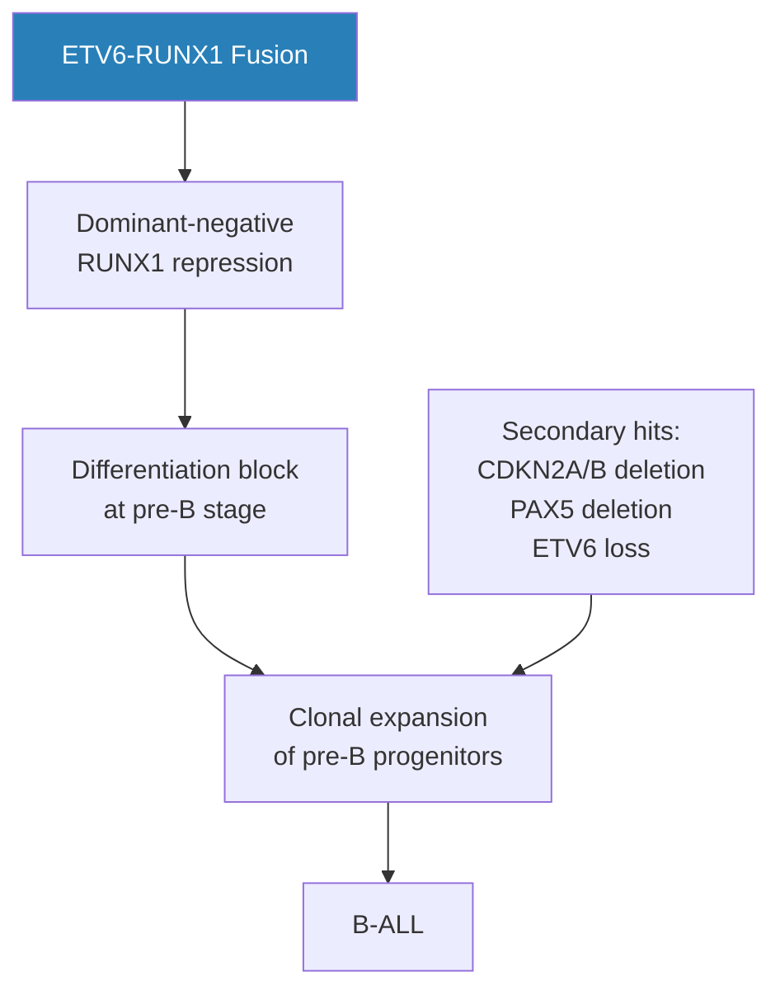
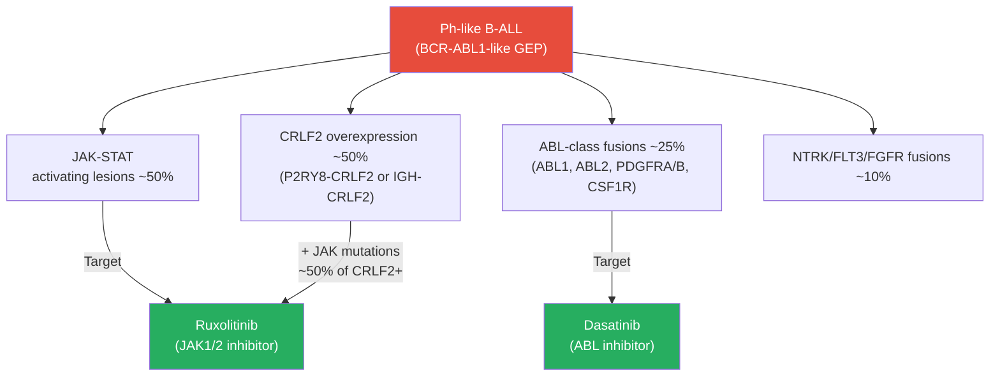
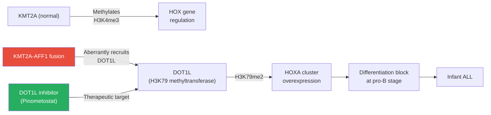
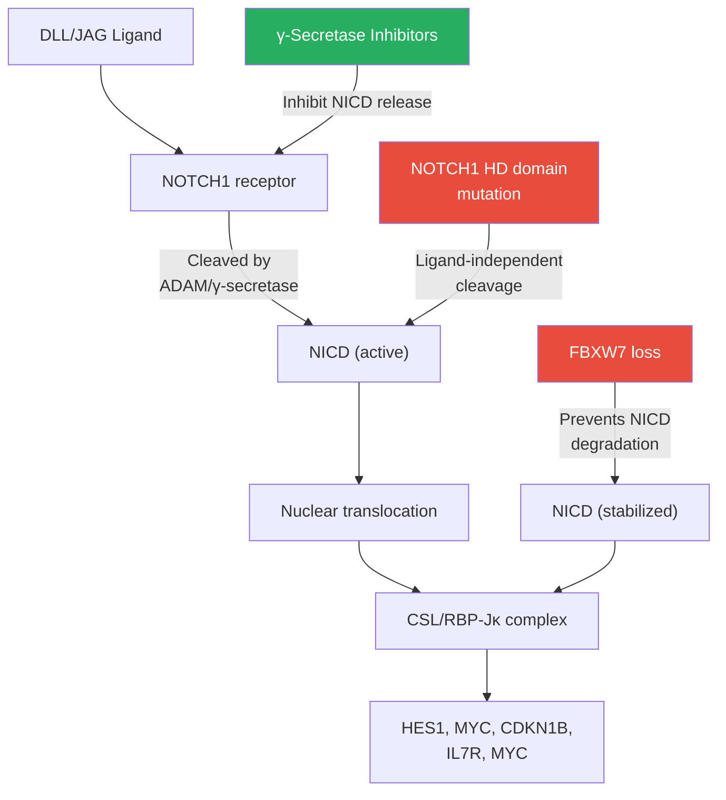
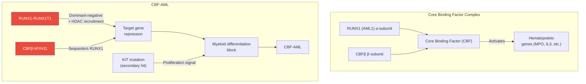
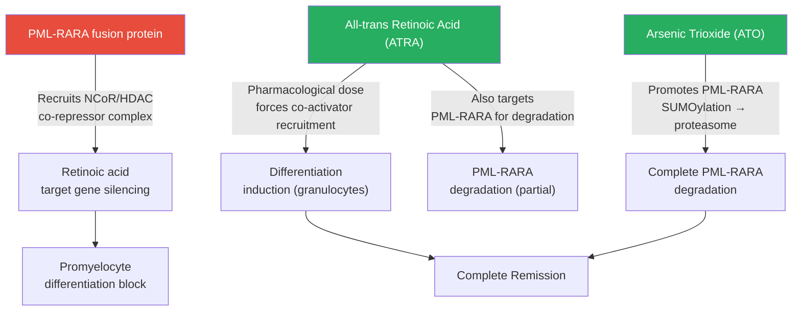
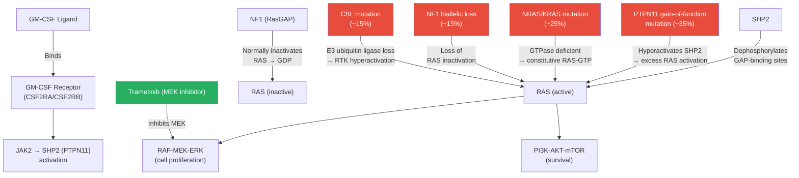
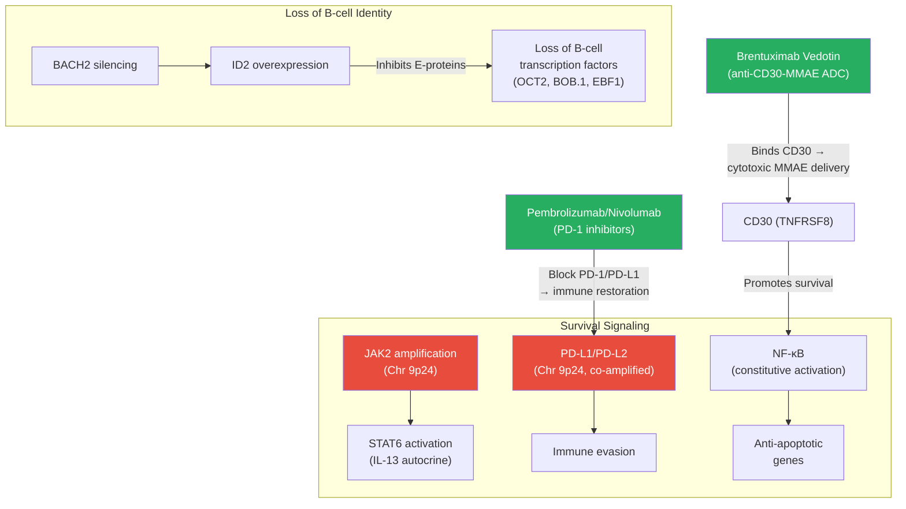
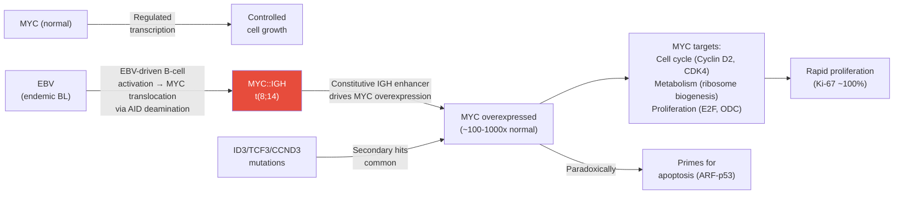

# Pediatric Hematological Tumors

Hematological malignancies — leukemias and lymphomas — are the **most common pediatric cancers**, accounting for ~40-45% of all childhood malignancies. Major advances in molecular characterization, risk stratification, and targeted therapy have transformed outcomes, with B-cell ALL achieving >90% cure rates in high-income countries. Yet significant challenges remain in high-risk subgroups, relapsed/refractory disease, and reducing long-term toxicity.

> **Parent Page**: [Pediatric Tumors Overview](10-pediatric-tumors.md)

---

## Table of Contents

1. [Epidemiology](#epidemiology)
2. [Acute Lymphoblastic Leukemia (ALL)](#acute-lymphoblastic-leukemia-all)
3. [Acute Myeloid Leukemia (AML)](#acute-myeloid-leukemia-aml)
4. [Juvenile Myelomonocytic Leukemia (JMML)](#juvenile-myelomonocytic-leukemia-jmml)
5. [Hodgkin Lymphoma](#hodgkin-lymphoma)
6. [Non-Hodgkin Lymphoma](#non-hodgkin-lymphoma)
7. [Minimal Residual Disease Monitoring](#minimal-residual-disease-monitoring)
8. [Hematopoietic Stem Cell Transplantation](#hematopoietic-stem-cell-transplantation)
9. [References](#references)

---

## Epidemiology

### Incidence and Trends

| Malignancy | Incidence (per million children/year) | Age Peak | Sex | 5-Year OS |
|-----------|--------------------------------------|----------|-----|-----------|
| ALL (B-ALL) | 35-40 | 2-5 years | M>F (slight) | ~90-93% |
| ALL (T-ALL) | 5-7 | 10-15 years | M>>F (3:1) | ~75-85% |
| AML | 7-9 | Infants + teens | M=F | ~65-70% |
| JMML | 1.3 | <4 years | M>F (2:1) | ~50-60% (with SCT) |
| Hodgkin Lymphoma | 5-8 | Teens (15-19y) | M>F | >95% |
| Non-Hodgkin Lymphoma | 8-10 | 7-15 years | M>F | ~75-90% (type-dependent) |
| CML | 0.5-1 | Teens | M=F | >85% (TKI era) |

### Incidence by Geographic Region

- Higher incidence in white/Hispanic children vs Black children (ALL)
- Burkitt Lymphoma: endemic in sub-Saharan Africa (EBV-driven), sporadic elsewhere
- Adult T-cell leukemia/lymphoma: HTLV-1 endemic regions (Japan, Caribbean)

---

## Acute Lymphoblastic Leukemia (ALL)

ALL is the **most common pediatric cancer**, representing ~25-30% of all childhood malignancies. It arises from malignant transformation of lymphoid progenitor cells (B or T lineage) in the bone marrow.


*Figure 1: Bone marrow aspirate in B-cell ALL — hypercellular marrow replaced by monotonous lymphoblasts with scant cytoplasm, irregular nuclear contour, and inconspicuous nucleoli. May-Grünwald-Giemsa stain. Source: Wikimedia Commons / Paulo Henrique Orlandi Mourao (CC BY-SA 3.0)*

### Immunophenotyping

Flow cytometry defines lineage and maturation stage — critical for classification and treatment selection:

#### B-cell ALL Maturation Stages

| Stage | CD19 | CD10 | CD34 | CD20 | Ig | Key Features |
|-------|------|------|------|------|-----|-------------|
| Pro-B (B-I) | + | - | + | - | - | Infant ALL, KMT2A rearrangements |
| Common/Pre-B (B-II) | + | + | +/- | -/+ | - | Most frequent (45%); ETV6-RUNX1, hyper-diploidy |
| Pre-B (B-III) | + | + | - | +/- | cytoplasmic μ | TCF3-PBX1 |
| Mature B | + | -/+ | - | + | surface | Burkitt leukemia |

#### T-cell ALL Maturation Stages (Bain classification)

| Stage | CD2 | CD3 | CD4 | CD8 | CD7 | CD34 |
|-------|-----|-----|-----|-----|-----|------|
| ETP-ALL | + | cytoplasmic | - | - | + | + |
| Early T | + | cytoplasmic | - | - | + | - |
| Cortical T | + | cytoplasmic | + | + | + | - |
| Mature T | + | surface | +/- | +/- | + | - |

**ETP-ALL (Early T-cell Precursor)**: Distinct subtype with stem cell/myeloid immunophenotype (CD5 weak/negative, CD1a negative, stem cell markers positive). Associated with FLT3 mutations, high relapse risk. Now eligible for high-risk protocols.

---

### B-cell ALL — Molecular Subtypes

The molecular landscape of B-ALL has been dramatically refined by RNA-seq and DNA methylation profiling, identifying >20 distinct subtypes:

```
B-ALL MOLECULAR SUBTYPES BY FREQUENCY:

ETV6-RUNX1 fusion (TEL-AML1)     ████████████████    25%  ← Most common; excellent prognosis
High Hyperdiploidy (51-67 chr)   ████████████████    25%  ← Excellent prognosis
Ph-like (BCR-ABL1-like)          ████████            15%  ← High risk; targetable
KMT2A rearranged                 ████                 7%  ← Infant ALL especially
TCF3-PBX1 (E2A-PBX1)            ████                 6%  ← Intermediate prognosis
Ph+ (BCR-ABL1)                   ████                 4%  ← TKI-responsive
DUX4 rearranged                  ███                  5%  ← New; excellent prognosis
iAMP21                           ██                   3%  ← High risk
MEF2D rearranged                 ██                   3%  ← High risk
Near-haploidy/Low hypodiploidy   ██                   3%  ← Very poor
ZNF384 rearranged                ██                   3%  ← Intermediate
NUTM1 rearranged                 █                    2%  ← Infant; good prognosis
Other/Unknown                    ████                 7%
```

#### ETV6-RUNX1 (TEL-AML1) ALL

**Molecular features:**
- Cryptic translocation t(12;21)(p13;q22) — not detectable by conventional karyotype
- ETV6-RUNX1 fusion protein acts as a **dominant-negative transcriptional repressor** of RUNX1 target genes
- Inhibits normal hematopoietic differentiation → progenitor cell expansion
- Often requires secondary hits: deletion of remaining ETV6 allele, CDKN2A/B, PAX5



**Clinical features:**
- Age: Peak 2-5 years
- WBC: Usually low-moderate
- CNS involvement: Rare
- **5-year OS: ~90-95%** — best prognosis of common B-ALL subtypes
- MRD clearance: Rapid, typically MRD-negative by end induction

#### High Hyperdiploidy (HeH)

**Molecular features:**
- >50 chromosomes per leukemic cell (up to 67)
- Characteristic pattern: +4, +10, +17, +21 (chromosome gains)
- Mechanism: Abnormal mitosis → multiple non-disjunction events
- Extra chromosomes activate kinase signaling (trisomy 21 → DYRK1A activation)

**Clinical features:**
- Age: 2-7 years
- **5-year OS: ~90-93%**
- **Sensitive to methotrexate and antimetabolites** (extra folate metabolism through chromosome 21)
- FISH: +4, +10 (if present together → excellent prognosis, "double trisomy")

#### Ph-like ALL (BCR-ABL1-like)

One of the most clinically important recent discoveries — **Ph-like ALL** shares a gene expression profile with Ph+ ALL but lacks the BCR-ABL1 fusion:



**JAK-STAT activating alterations in Ph-like ALL:**

| Alteration | Frequency | Target |
|-----------|-----------|--------|
| CRLF2 overexpression (P2RY8-CRLF2 or IGH-CRLF2) | ~50% of Ph-like | CRLF2/JAK1 |
| JAK1/2 mutations | ~18% | JAK1/2 |
| IL7R mutations | ~10% | IL-7 receptor → JAK/STAT |
| EPOR fusions | ~5% | Erythropoietin receptor → JAK2 |

**ABL-class fusions (TKI-targetable):**

| Fusion | Gene | TKI Sensitivity |
|--------|------|----------------|
| NUP214-ABL1 | ABL1 | Imatinib, Dasatinib |
| ETV6-ABL1 | ABL1 | Imatinib, Dasatinib |
| RCSD1-ABL2 | ABL2 | Dasatinib, Ponatinib |
| ETV6-PDGFRB | PDGFRB | Imatinib |

**Clinical:** Ph-like ALL is associated with **poor prognosis** under standard chemotherapy (OS ~50-60% in some series). Identifying Ph-like ALL and its specific alteration is critical for targeted therapy intensification.

#### Ph+ ALL (BCR-ABL1)

**Molecular features:**
- t(9;22)(q34;q11) — Philadelphia chromosome
- BCR-ABL1 fusion → constitutive ABL1 kinase activity → RAS/MAPK, PI3K/AKT, JAK/STAT activation
- Most common in adults (25%); less in children (~3-5%)

**Treatment revolution — TKI addition:**
| Era | Treatment | 5-Year EFS |
|-----|-----------|-----------|
| Pre-TKI (2000) | Intensive chemo + allo-SCT | ~30-35% |
| TKI era 1 (imatinib + chemo) | COG AALL0031 | ~50-70% |
| TKI era 2 (dasatinib + chemo) | AALL0434, EsPhALL | ~65-75% |
| Current (dasatinib/ponatinib + blinatumomab) | Emerging | ~80%+ |

**Current paradigm:**
- Dasatinib (CNS-penetrant, 2nd gen TKI) + standard chemotherapy → highly MRD-sensitive
- MRD-negative patients may avoid allo-SCT (chemotherapy-only approaches)
- **Blinatumomab** (anti-CD19/CD3 BiTE) combined with TKI: emerging as post-induction consolidation

#### KMT2A (MLL)-Rearranged ALL — Infant ALL

**Infant ALL** (age <1 year) is a distinct entity with near-universally poor prognosis:

**KMT2A (MLL) biology:**
- KMT2A normally encodes a histone H3K4 methyltransferase (MLL1) essential for HOX gene regulation
- KMT2A rearrangements occur in >70% of infant ALL (vs ~7% of childhood ALL overall)
- >80 different partner genes identified; most common in infant ALL:

| Partner | Frequency | Clinical |
|---------|-----------|---------|
| AFF1 (AF4) | t(4;11) | ~50% of KMT2A-r infant ALL; pro-B; worst prognosis |
| MLLT3 (AF9) | t(9;11) | ~15%; also in AML |
| MLLT1 (ENL) | t(11;19) | ~15%; also in AML |
| MLLT10 (AF10) | t(10;11) | ~10% |

**KMT2A-AFF1 mechanism:**



**Clinical features of infant ALL:**
- Age: <12 months
- WBC: Very high (often >100,000/μL)
- CNS involvement: ~50%
- Pro-B immunophenotype (CD10 negative)
- Steroid resistance: Common
- **5-year OS: ~25-40%** (KMT2A-r); ~65% (KMT2A-germline)
- Allo-SCT: Standard for KMT2A-r; debated (does not overcome biology)
- **Venetoclax** (BCL-2 inhibitor): Preclinical activity; INTERFANT-21 incorporating venetoclax

#### DUX4-Rearranged ALL

A newer recognized entity (~5% of B-ALL):
- DUX4 transcription factor rearranged to immunoglobulin loci → overexpression
- Associated with ERG deletion, IKZF1 deletion
- **Excellent prognosis** (~90-95% OS) — often compared to ETV6-RUNX1
- ERG-deleted B-ALL is essentially the same entity

#### Near-Haploidy and Low Hypodiploidy

Rare but critical to recognize — frequently misidentified on karyotype as hyperdiploid (doubled karyotype):

| Subtype | Chromosome Range | 5-Year OS | Notes |
|---------|-----------------|-----------|-------|
| Near-haploidy | 24-31 chromosomes | ~30-40% | RAS pathway mutations prominent |
| Low hypodiploidy | 32-39 chromosomes | ~40-50% | TP53 mutations ~90%; Li-Fraumeni associated |

**Detection**: DNA index <0.85 (near-haploidy ~0.5, low hypodiploidy ~0.7); FISH; SNP array. When a doubled karyotype is seen with modal N in 70-80s range, suspect doubled hypodiploidy.

---

### T-cell ALL

T-ALL represents ~15-20% of pediatric ALL with distinct molecular biology:

#### Molecular Drivers of T-ALL

**NOTCH1 signaling — the dominant pathway:**
- NOTCH1 and/or FBXW7 mutations: ~60% of T-ALL
- NOTCH1 is normally activated by ligand (DLL/JAG) → ADAM/γ-secretase cleavage → NICD nuclear translocation → target gene activation (MYC, HES1, etc.)
- Gain-of-function NOTCH1 mutations in HD domain (ligand-independent activation) or PEST domain (prolonged signaling)
- FBXW7 loss: Prevents NICD degradation → constitutive signaling



**Transcription factor oncogenes (define T-ALL oncogenetic subtypes):**

| Subtype | Driver Gene | Frequency | Mechanism |
|---------|------------|-----------|-----------|
| TAL/LMO | TAL1, TAL2, LMO1, LMO2 | ~30% | Chromosomal translocation or STIL-TAL1 del |
| TLX1/3 (HOX11/HOX11L2) | TLX1, TLX3 | ~30% | t(10;14) or t(5;14) |
| HOXA | HOXA locus activation | ~10% | KMT2A-r, inv(7)(p15q35) |
| NKX2-1 | NKX2-1 | ~10% | t(2;14) |
| ETP-ALL | FLT3, DNMT3A, IDH1/2 | ~15% | Stem cell-like; myeloid features |

**Key tumor suppressors deleted in T-ALL:**
- **CDKN2A/B** (p16/p14, p15): ~70% of T-ALL — biallelic deletion → unchecked cell cycle
- **RB1**: ~10%
- **PTEN**: ~15% — PI3K pathway activation
- **WT1**: ~10%

#### ETP-ALL (Early T-cell Precursor ALL)

A distinct, high-risk T-ALL subtype defined by stem cell immunophenotype:
- **Immunophenotype**: CD5 weak/negative, CD1a negative, CD34+/-, CD117+, myeloid markers (CD13, CD33, CD11b, CD65)
- **Molecular**: FLT3 mutations (~25%), RAS mutations (~15%), DNMT3A/IDH mutations, myeloid-transcription factor mutations (GATA2, ETV6, RUNX1)
- Shares features with AML
- **Prognosis**: Historically poor (~50-60% OS); responding to AML-directed therapy
- **FLT3 inhibitors** (sorafenib, midostaurin) being studied

---

### ALL Treatment Protocols

#### Standard Treatment Framework (B-ALL, Average/Standard Risk)

```
B-ALL TREATMENT SCHEMA (COG AALL1231 / BFM 2009):

INDUCTION (4-6 weeks):
├── Prednisone/Dexamethasone (steroids)
├── Vincristine (weekly)
├── Asparaginase (PEG-asp or Erwinia)
├── Anthracycline (doxorubicin) — high-risk protocol
└── IT chemotherapy (MTX ± AraC ± hydrocortisone)
         [Day 29 bone marrow: ASSESS MRD]

CONSOLIDATION (8-28 weeks):
├── High-dose methotrexate (HD-MTX)
├── 6-Mercaptopurine (6-MP)
├── Asparaginase (continued)
└── IT chemotherapy (continuing CNS prophylaxis)

INTERIM MAINTENANCE:
├── Oral methotrexate + 6-MP
└── IT chemotherapy

DELAYED INTENSIFICATION (re-induction, 8 weeks):
├── Dexamethasone
├── Vincristine, doxorubicin
├── Asparaginase
├── Cyclophosphamide, thioguanine, AraC
└── IT chemotherapy

MAINTENANCE (2-3 years total):
├── Daily 6-Mercaptopurine (oral)
├── Weekly Methotrexate (oral)
└── IT chemotherapy (monthly × 6-12 months, then less frequent)
│
Total treatment duration: ~2 years (girls), ~3 years (boys)
```

#### Risk Stratification

| Risk Group | Criteria | Approach | 5-Year EFS |
|------------|---------|---------|-----------|
| Low Risk | NCI SR (age 1-9, WBC <50k) + ETV6-RUNX1 or HeH, rapid early response, MRD<0.01% | Reduced therapy | ~95% |
| Standard Risk | NCI SR, favorable biology, MRD<0.01% end induction | Standard | ~88-90% |
| High Risk | NCI HR (age ≥10 or WBC ≥50k), or slow response, or unfavorable biology | Intensified | ~72-80% |
| Very High Risk | Ph+, Ph-like, KMT2A-r, ETP, iAMP21, near-haploidy, MRD+end induction | Most intensive ± SCT | ~50-65% |

**NCI Risk Classification:**
- Standard Risk (SR): 1-9 years AND WBC <50,000/μL
- High Risk (HR): Age <1 or ≥10 years OR WBC ≥50,000/μL

#### Asparaginase — A Cornerstone of Pediatric ALL

L-asparaginase depletes asparagine from the bloodstream. Leukemic lymphoblasts lack asparagine synthetase → selective cell death.

| Formulation | Organism | Half-life | Route | Notes |
|------------|---------|---------|-------|-------|
| Native E. coli L-asp | E. coli | ~1.2 days | IM/IV | Replaced by pegylated |
| PEG-asparaginase (PEG-asp, Oncaspar) | E. coli (PEGylated) | ~5.7 days | IM/IV | Standard in US protocols |
| Erwinia asparaginase (Erwinaze) | Erwinia chrysanthemi | ~0.6 days | IM | Used for PEG-asp allergy |
| Calaspargase pegol (Asparlas) | E. coli (PEGylated) | ~16 days | IV | Longer duration, less frequent dosing |

**Asparaginase toxicities:**
- Allergic reaction / silent hypersensitivity → switch formulation
- Pancreatitis (3-10%) — discontinue if severe
- Thrombosis (5-10%) — especially venous; monitor
- Hepatotoxicity (hyperbilirubinemia)
- Hypertriglyceridemia
- Coagulopathy (low fibrinogen, ATIII)

#### Targeted Therapies in ALL

| Drug | Target | Indication | Status |
|------|--------|------------|--------|
| Imatinib | BCR-ABL1 | Ph+ ALL | Standard + chemo |
| Dasatinib | BCR-ABL1, Src | Ph+ ALL | Standard (preferred in CNS) |
| Ponatinib | BCR-ABL1 (T315I) | Ph+ ALL, TKI-resistant | Phase II; promising |
| Ruxolitinib | JAK1/2 | Ph-like (JAK-STAT) | COG AALL1231 phase III |
| Blinatumomab | CD19×CD3 (BiTE) | B-ALL, relapsed | FDA approved; now in frontline |
| Inotuzumab ozogamicin (InO) | CD22-calicheamicin | Relapsed B-ALL | FDA approved; frontline trials |
| Tisagenlecleucel (Kymriah) | CD19 CAR-T | B-ALL relapsed/refractory | FDA approved ≥25 years |
| Brexucabtagene autoleucel | CD19 CAR-T | Adult Ph+ ALL | FDA approved |
| Nelarabine | T-cell-selective nucleoside analogue | T-ALL/T-LBL | Standard in relapsed T-ALL |
| Bortezomib | Proteasome | T-ALL (frontline) | COG trials |
| Venetoclax | BCL-2 | Infant ALL, relapsed | Phase I/II |

#### Blinatumomab — Bispecific T-cell Engager (BiTE)

Blinatumomab is a bispecific antibody that simultaneously binds **CD19** on B-ALL cells and **CD3** on T-cells, bringing them into proximity to trigger T-cell-mediated lysis:

```
BLINATUMOMAB MECHANISM:

        CD19 (B-ALL)         CD3 (T-cell)
             │                    │
             ▼                    ▼
         ┌───┐              ┌─────┐
         │ALL├──BLINATUMOMAB─┤ T   │
         │ cell│              │cell │
         └───┘              └─────┘
              ←  Cytotoxic synapse  →
                  T-cell kills ALL cell
                  (without MHC restriction)
```

**Clinical data:**
- CR rate in relapsed/refractory B-ALL: ~40-70%
- MRD negativity: ~75% of responders
- Now being incorporated into **frontline** treatment (AALL1731, ECOG E1910 — adults)

#### CAR-T Cell Therapy for B-ALL

Tisagenlecleucel (Kymriah) — the first CAR-T therapy FDA-approved in pediatrics (2017):

**Mechanism:**
```
CHIMERIC ANTIGEN RECEPTOR (CAR) STRUCTURE:

  Extracellular domain:
  ┌─────────────────────────────────┐
  │  scFv (single-chain variable    │
  │  fragment) anti-CD19            │  ← Antigen recognition
  └────────────────┬────────────────┘
                   │
  Transmembrane domain:
  ═══════════════════════════════════
  Intracellular signaling domains:
  ┌─────────────────────────────────┐
  │  CD28 or 4-1BB (co-stimulatory) │  ← T-cell persistence
  │  CD3ζ (activating)              │  ← T-cell activation
  └─────────────────────────────────┘
```

**Clinical outcomes (ELIANA trial, Maude et al., 2018):**
- Remission rate: 81% overall remission (63% CR, 18% CRi)
- MRD-negative rate: ~97% of responders
- 12-month EFS: 50%
- 12-month OS: 76%
- **Toxicity**: CRS (cytokine release syndrome) — Grade 3/4 in ~47%; Neurotoxicity (ICANS) — Grade 3/4 in ~13%; B-cell aplasia (ongoing, manageable with IVIG)

---

## Acute Myeloid Leukemia (AML)

Pediatric AML is the second most common pediatric leukemia (~15% of childhood leukemia), with overall outcomes significantly worse than ALL (~65-70% 5-year OS) despite intensive therapy.


*Figure 2: Peripheral blood smear in Acute Promyelocytic Leukemia (AML-M3/APL). Hypergranular promyelocytes with abundant azurophilic granules and Auer rods (pink needle-like crystalline inclusions). Wright-Giemsa stain. Source: Wikimedia Commons (public domain)*

### WHO 2022 AML Classification (Pediatric Perspective)

| Category | Genetic Lesion | Frequency (Pediatric AML) |
|----------|---------------|--------------------------|
| AML with RUNX1-RUNX1T1 | t(8;21)(q22;q22) | ~12-15% |
| AML with CBFB-MYH11 | inv(16)(p13q22) or t(16;16) | ~10-12% |
| APL with PML-RARA | t(15;17)(q24;q21) | ~5-8% |
| AML with KMT2A rearrangement | t(9;11), t(10;11), t(6;11), others | ~20% |
| AML with NUP98 rearrangement | NUP98-NSD1, NUP98-KDM5A | ~8-10% |
| AML with FLT3-ITD | FLT3 internal tandem duplication | ~15-20% |
| AML with NPM1 mutation | NPM1 (exon 12) | ~6-8% |
| AML with CEBPA mutation | biallelic CEBPA | ~4-6% |
| AML with DEK-NUP214 | t(6;9)(p23;q34) | ~1-2% |
| DS-AMKL | Trisomy 21 + GATA1 mutation | ~1-2% |
| AML-NOS | None of above | ~20-25% |

### Core Binding Factor AML (CBF-AML)

CBF-AML comprises t(8;21) and inv(16) — together ~22-27% of pediatric AML:

**RUNX1-RUNX1T1 (t(8;21)):**
- RUNX1 (AML1) is the α subunit of core binding factor (CBF), essential transcription factor for hematopoiesis
- RUNX1T1 (ETO) is a transcriptional corepressor
- Fusion acts as a dominant-negative, recruiting HDAC complexes → silences RUNX1 target genes
- **Prognosis**: Favorable (~65-70% OS); cytarabine-sensitive
- **Secondary hits**: KIT mutations (~20%), NRAS/KRAS (~15%)

**CBFB-MYH11 (inv(16)/t(16;16)):**
- CBFβ (CBFB) is the β subunit of CBF
- MYH11 is smooth muscle myosin heavy chain
- Fusion sequesters RUNX1 and prevents normal transcription
- **Prognosis**: Most favorable of all AML subtypes (~75-80% OS); high cytarabine sensitivity



### Acute Promyelocytic Leukemia (APL)

APL is a **medical emergency** due to life-threatening coagulopathy (DIC), but also has the **best prognosis** with targeted therapy.

**Molecular features:**
- **PML-RARA fusion** from t(15;17): Dominant-negative antagonism of retinoic acid receptor α → differentiation block at promyelocyte stage
- Rare variant fusions: PLZF-RARA, NPM1-RARA, STAT5B-RARA (these variants respond poorly to ATRA)

**Mechanism of ATRA + Arsenic:**


**Treatment:**
- **ATRA + ATO (arsenic trioxide)**: Non-chemotherapy regimen; curative in >95% of non-high-risk APL
- High-risk APL (WBC >10,000/μL): ATRA + ATO + anthracycline
- **Differentiation syndrome** (DS): Life-threatening complication of ATRA/ATO — fever, pulmonary infiltrates, effusions, weight gain → treat with dexamethasone 10 mg/m² BID + temporary drug hold
- **DIC management**: FFP, cryoprecipitate, platelets — critical in first days

### KMT2A Rearrangements in AML

KMT2A rearrangements are the **most common single abnormality in pediatric AML** (~20%):

| Fusion | t | Frequency | Prognosis |
|--------|---|-----------|-----------|
| KMT2A-MLLT3 (MLL-AF9) | t(9;11) | ~40% of KMT2A-r | Intermediate |
| KMT2A-ELL | t(11;19) | ~15% | Intermediate |
| KMT2A-MLLT10 (MLL-AF10) | t(10;11) | ~15% | Poor |
| KMT2A-MLLT4 (MLL-AF6) | t(6;11) | ~10% | Poor |
| KMT2A-MLLT1 (MLL-ENL) | t(11;19) | ~10% | Intermediate |

**Mechanism**: KMT2A fusions recruit the super elongation complex (SEC) and DOT1L to HOX gene loci → HOXA/HOXB cluster overexpression → differentiation block.

### FLT3-ITD in Pediatric AML

FLT3-ITD (internal tandem duplication of the juxtamembrane domain of FLT3) is a poor prognostic marker:

**FLT3 signaling:**
```mermaid
graph LR
    FLT3["FLT3 (normal)"] --> |"Ligand-dependent\ndimerization"| FLT3_SIGNAL["Downstream signaling"]

    FLT3_ITD["FLT3-ITD\n(constitutive active)"] --> |"Ligand-independent\ndimerization"| RAS_AML["RAS/MAPK"]
    FLT3_ITD --> PI3K_AML["PI3K/AKT"]
    FLT3_ITD --> STAT5["STAT5 activation"]

    RAS_AML --> PROLIF["Proliferation"]
    PI3K_AML --> SURVIVAL["Survival"]
    STAT5 --> PROLIF

    MIDOSTAURIN["Midostaurin\n(FLT3 inhibitor)"] --> |"Inhibits"| FLT3_ITD
    QUIZARTINIB["Quizartinib\n(selective FLT3i)"] --> |"Inhibits"| FLT3_ITD
    GILTERITINIB["Gilteritinib\n(selective FLT3i)"| ] --> |"Inhibits"| FLT3_ITD

    style FLT3_ITD fill:#e74c3c,color:#fff
    style MIDOSTAURIN fill:#27ae60,color:#fff
```

**FLT3-ITD allelic ratio:**
- High allelic ratio (HAR, ITD:WT FLT3 ≥0.5): Very poor prognosis
- Low allelic ratio + NPM1 co-mutation (in adults): Intermediate/favorable
- In pediatric AML: FLT3-ITD always confers adverse prognosis regardless of ratio

### NUP98 Rearrangements — Pediatric-Specific Bad Actors

NUP98 rearrangements are particularly prevalent in pediatric AML and carry very poor prognosis:

| Fusion | Frequency | Prognosis |
|--------|-----------|-----------|
| NUP98-NSD1 | ~6% of pediatric AML | Very poor (~30-35% OS) |
| NUP98-KDM5A | ~3-4% | Very poor |
| NUP98-HOXA9 | ~1% | Very poor |

**Mechanism**: NUP98 fusions acquire strong transcriptional activation domains that drive HOX gene upregulation similar to KMT2A fusions. NUP98-NSD1 is the most studied: NSD1 histone methyltransferase drives H3K36me2 — aberrant gene activation of HOXA cluster.

### Down Syndrome AML (DS-AMKL)

Children with Down syndrome (trisomy 21) have ~20-fold increased risk of AML:

**Two-step DS leukemia model:**

```
GATA1 somatic mutation (transient abnormal myelopoiesis, TAM):
Occurs in ~10% of neonates with Down syndrome
         │
         ▼
TAM (spontaneous resolution in ~80%)
         │
         └──10-20% → Acquire secondary mutations → DS-AMKL
              (CTCF, cohesin complex, EZH2, KANSL1, etc.)
```

**Key features of DS-AMKL:**
- **GATA1 mutations** (exon 2/3): Always present; truncating/nonsense → N-terminal GATA1 short isoform (GATA1s)
- Megakaryoblastic differentiation (AMKL)
- **Very sensitive to cytarabine**: DS-AMKL cells express low cytidine deaminase → reduced AraC catabolism → increased efficacy
- **OS: ~85-90%** with reduced-intensity chemotherapy (lower doses to avoid excessive toxicity in DS patients)
- Standard dose reduction (25-50%) of cytarabine vs non-DS AML

### Pediatric AML Treatment

#### Induction Chemotherapy

**"7+3" backbone (standard):**
```
AML INDUCTION (MRC AML17, COG AAML1031):

Cytarabine (AraC):  100-200 mg/m²/day × 7-10 days (continuous IV)
Anthracycline:      Daunorubicin 50-60 mg/m²/day × 3 days
                    OR Idarubicin 12 mg/m²/day × 3 days
Etoposide:          ±100 mg/m²/day × 5 days (AAML protocol)
Gemtuzumab ozogamicin (GO): ±3 mg/m² (COG AAML1031 — improved EFS in CBF-AML)
```

**APL induction (ATRA + ATO):**
```
ATRA: 25 mg/m²/day divided BID (continuous until CR)
ATO:  0.15 mg/kg/day (non-high-risk: 5 days/week)
Anthracycline: Added for WBC >10,000 (high-risk APL)
```

#### Consolidation and Post-Remission Therapy

| Risk Group | Strategy | OS |
|-----------|---------|-----|
| Low Risk (CBF-AML, CEBPA bi, DS-AMKL, NPM1 mutated) | Chemotherapy only (4 cycles HD-AraC) | ~75-85% |
| Standard Risk | Chemotherapy ± allo-SCT (MRD-guided) | ~60-70% |
| High Risk (FLT3-ITD, NUP98-r, complex karyotype, primary refractory) | Allo-SCT in CR1 | ~40-55% |

#### Targeted Therapies in AML

| Target | Drug | Indication | Status |
|--------|------|-----------|--------|
| FLT3-ITD/TKD | Midostaurin | FLT3+ AML (adults); pediatric trial | FDA approved adults; pediatric phase II |
| FLT3-ITD | Quizartinib | FLT3-ITD+ relapsed AML | FDA approved adults 2023 |
| FLT3-ITD/TKD | Gilteritinib | Relapsed FLT3+ AML | FDA approved adults |
| CD33 | Gemtuzumab ozogamicin (GO) | CD33+ AML | FDA approved; incorporated in frontline (CBF-AML benefit) |
| IDH1 | Ivosidenib | IDH1-mutant AML | FDA approved adults; rare in pediatrics |
| IDH2 | Enasidenib | IDH2-mutant AML | FDA approved adults; rare in pediatrics |
| BCL-2 | Venetoclax | AML induction/relapsed | Standard adults; Phase I/II pediatric |
| CD123 | Tagraxofusp (SL-401) | BPDCN, AML | Phase I/II |
| Menin | Revumenib, DSP-5336 | KMT2A-r / NUP98-r / NPM1-mutant AML | Phase I/II — remarkable responses; breakthrough designation |

**Menin inhibitors — a revolution for KMT2A-r and NPM1-mutant AML:**
- Menin protein is essential for KMT2A-fusion complex to maintain HOXA gene expression
- Menin inhibitors (revumenib = SNDX-5613; DSP-5336) disrupt KMT2A-menin interaction → HOXA downregulation → differentiation
- Phase I results in relapsed/refractory KMT2A-r/NPM1-mutant: ~30-53% CR/CRh rates
- FDA Breakthrough designation; now entering frontline trials in combination with AML induction

---

## Juvenile Myelomonocytic Leukemia (JMML)

JMML is a rare but clinically challenging pediatric myeloproliferative/myelodysplastic neoplasm exclusive to young children, defined by **RAS pathway hyperactivation**.


*Figure 3: Peripheral blood smear in JMML showing monocytosis, left shift with myeloid precursors, and rare blasts. Wright-Giemsa stain. Source: Wikimedia Commons / Paulo Henrique Orlandi Mourao (CC BY-SA 3.0)*

### WHO Diagnostic Criteria for JMML

All 3 mandatory criteria + ≥1 confirmatory criterion:

**Mandatory:**
1. Peripheral blood monocyte count ≥1 × 10⁹/L
2. Blasts <20% in blood and bone marrow
3. Splenomegaly

**Confirmatory (need ≥1):**
- Somatic or germline PTPN11, KRAS, NRAS, CBL, or NF1 mutation
- Monosomy 7 or other chromosomal abnormality
- HbF elevated for age (>2%)
- WBC >10 × 10⁹/L
- Hypersensitivity to GM-CSF in vitro (colony assay)
- Hypermethylation of RRAS pathway genes (in appropriate context)

### Molecular Biology — RAS Pathway Hyperactivation

JMML is a model disease for studying **RAS pathway oncogenesis**:



### JMML Genetic Alterations — Clinical Correlates

| Gene | Mutation Type | Frequency | Associated Syndrome | Prognosis |
|------|-------------|-----------|--------------------|-|
| PTPN11 | Somatic gain-of-function | ~35% | Noonan syndrome (germline → lower grade disease) | Intermediate |
| NRAS | Somatic G12/G13/Q61 | ~15% | Noonan with/out other features | Variable |
| KRAS | Somatic G12/G13/Q61 | ~10% | Noonan (some germline) | Poor (somatic) |
| NF1 | Biallelic loss (somatic) | ~15% | Neurofibromatosis 1 | Poor |
| CBL | Biallelic inactivation (LOH) | ~15% | CBL syndrome (germline UPD) | Variable; some spontaneous resolution |
| Monosomy 7 | Chromosomal | ~10% | None (acquired) | Poor |

**PTPN11 Noonan vs somatic JMML:**
- Germline PTPN11 (Noonan syndrome) → mild JMML-like picture → often self-limited, no SCT
- Somatic PTPN11 → true JMML requiring SCT

### DNA Methylation in JMML

High DNA methylation at specific loci (hypermethylation score ≥0.44) identifies a poor-prognosis subgroup:

| Methylation Group | Frequency | 5-Year OS |
|-----------------|-----------|-----------|
| Low methylation | ~50% | ~75% (post-SCT) |
| High methylation | ~50% | ~25% (post-SCT) |

Hypermethylation reflects epigenetic dysregulation and represents an additional prognostic layer beyond genetics.

### JMML Treatment

```
JMML TREATMENT ALGORITHM:

 DIAGNOSIS
      │
 MOLECULAR TESTING (PTPN11/KRAS/NRAS/NF1/CBL)
      │
 ┌────┴────────────────────────────────────────────┐
 │                                                  │
 GERMLINE PTPN11/KRAS                           SOMATIC RAS
 (Noonan syndrome)                               MUTATION
 Mild clinical picture                                │
      │                                               │
 OBSERVATION                              HEMATOPOIETIC SCT
 (may resolve spontaneously)              (only curative approach)
      │                                               │
 Progressive disease                    Allo-SCT (MSD/MUD/haplo)
      │                                               │
 Enroll in clinical trial                Conditioning:
 (Trametinib/Azacitidine)               Fludarabine + Treosulfan/Busulfan
                                               │
                                        POST-SCT
                                        (rapid donor chimerism essential)
                                               │
                                        Relapse (~30-40%):
                                        DLI + Trametinib
```

**Trametinib in JMML:**
- MEK inhibitor (FDA-approved for BRAF V600E melanoma); rational target for RAS-hyperactivated JMML
- Phase II (COG AAML1921): ORR ~48%; CRs seen; can bridge to SCT
- Being studied in frontline combination and as post-SCT maintenance to prevent relapse

---

## Hodgkin Lymphoma

Hodgkin Lymphoma (HL) is the **most common malignant lymphoma in adolescents** (15-19 years), with an overall cure rate >95%.

### Histological Subtypes

**Classical Hodgkin Lymphoma (cHL):**

| Subtype | Frequency | EBV Association | Age | Notes |
|---------|-----------|----------------|-----|-------|
| Nodular Sclerosis (NSHL) | ~70% | ~20% | Teens/young adults | Mediastinal masses; most common in adolescents |
| Mixed Cellularity (MCHL) | ~20% | ~50-75% | Younger children | EBV-driven; developing countries |
| Lymphocyte-Rich (LRHL) | ~5% | ~30% | Adults > children | Excellent prognosis |
| Lymphocyte-Depleted (LDHL) | <1% | ~70% | Adults; HIV+ | Worst prognosis; now rare |

**Nodular Lymphocyte-Predominant Hodgkin Lymphoma (NLPHL):**
- Rare (~5% of HL)
- Distinct entity; CD20+ LP cells ("popcorn cells"), not Reed-Sternberg
- CD30-/CD15-; EBV negative
- Indolent; rituximab-sensitive
- Risk of transformation to DLBCL

### The Reed-Sternberg Cell — Molecular Biology

The malignant cell in cHL is the **Hodgkin Reed-Sternberg (HRS) cell** — a clonal B-cell that has lost B-cell identity:

```
REED-STERNBERG CELL CHARACTERISTICS:

Morphology: Large binucleated/multinucleated cell, "owl-eye" nucleoli
Immunophenotype:
  CD30 (TNFRSF8): ++ (strong) — key therapeutic target
  CD15:           + (~80%)
  CD20:           -/+ (weak, 20-30%)
  CD45:           - (unlike normal B-cells)
  PAX5:           dim (compared to normal B-cells)
  OCT2:           - (B-cell transcription factor lost)
  BOB.1:          - (B-cell transcription factor lost)
  EBV-LMP1:       + in EBV+ cases
```

**Key molecular pathways in HRS cells:**



### HL Staging (Ann Arbor / Lugano)

| Stage | Definition |
|-------|-----------|
| I | Single lymph node region or single extralymphatic site |
| II | ≥2 lymph node regions, same side of diaphragm |
| III | Lymph node regions on both sides of diaphragm |
| IV | Diffuse extralymphatic disease (bone marrow, liver, lung, bone) |

**Modifiers:** A (no symptoms) / B (fever >38°C, night sweats, >10% weight loss); E (extralymphatic extension); X (bulky disease >10 cm or >1/3 mediastinal ratio)

### HL Treatment in Children and Adolescents

**Response-Adapted Therapy (standard approach):**

```
PEDIATRIC HODGKIN LYMPHOMA TREATMENT (COG AHOD1331 / EuroNet-PHL-C2):

Low Risk (Stage IA/IIA, no bulk, no B symptoms):
├── 2-3 cycles ABVD (or OEPA/COPDAC)
└── Involved Site Radiation (20-25.5 Gy) — only if PET-positive after chemo

Intermediate Risk (Stage IB, IIA bulk, IIIA, IVA):
├── 4 cycles ABVD or AVD + Brentuximab Vedotin
└── Involved Site Radiation — PET-guided

High Risk (B symptoms, Stage IIIB, IVB):
├── 6 cycles BEACOPP-escalated or ABVD
└── Consolidation radiation — PET-guided
```

**ABVD Regimen:**
- **A**driamycin (doxorubicin) 25 mg/m² days 1+15
- **B**leomycin 10 U/m² days 1+15
- **V**inblastine 6 mg/m² days 1+15
- **D**acarbazine 375 mg/m² days 1+15

**Late effects concerns in HL:**
- Bleomycin pulmonary toxicity (especially with bleomycin-based regimens)
- Cardiac toxicity (doxorubicin)
- Secondary breast cancer (radiation in young females)
- Secondary thyroid cancer
- **Trend**: Minimizing radiation dose and field; eliminating bleomycin when possible; substituting brentuximab vedotin

### Targeted Therapy in Relapsed HL

| Drug | Target | Evidence |
|------|--------|---------|
| Brentuximab Vedotin (BV) | CD30-MMAE ADC | 80-90% ORR in relapsed cHL; approved; now frontline (A+AVD) |
| Nivolumab (PD-1) | PD-1/PD-L1 | ~70-80% ORR in multiply-relapsed cHL; FDA approved |
| Pembrolizumab (PD-1) | PD-1/PD-L1 | ~70% ORR; FDA approved |
| Nivolumab + BV | Combination | SWOG S1826: Superior to BV+bendamustine in relapsed |
| Rituximab | CD20 | NLPHL (CD20+) |

---

## Non-Hodgkin Lymphoma

Pediatric NHL encompasses several distinct entities, collectively representing ~10-12% of pediatric cancers. Key differences from adult NHL:
- High-grade histology predominates (>90% in children vs ~40% in adults)
- Burkitt lymphoma and lymphoblastic lymphoma are most common
- Generally chemosensitive with high cure rates
- Indolent lymphomas (follicular, marginal zone) are rare in children


*Figure 4: Burkitt lymphoma, H&E stain demonstrating classic "starry sky" pattern. Dark lymphoma cells are interspersed with pale tingible-body macrophages engulfing apoptotic debris, creating the characteristic appearance. Source: Wikimedia Commons / Haymanj (public domain)*

### Burkitt Lymphoma (BL)

Burkitt Lymphoma is the **fastest-growing human malignancy** (tumor doubling time ~24 hours) and a highly curable tumor with appropriate intensive therapy.

#### Molecular Biology — MYC Translocation

The hallmark of BL is translocation of **MYC** (chromosome 8q24) to immunoglobulin gene loci:

| Translocation | Frequency | IG Partner |
|------------|-----------|-----------|
| t(8;14)(q24;q32) | ~80% | IGH (immunoglobulin heavy chain) |
| t(2;8)(p12;q24) | ~15% | IGK (kappa light chain) |
| t(8;22)(q24;q11) | ~5% | IGL (lambda light chain) |

**MYC translocations place MYC under constitutive IG promoter activity → massive MYC overexpression:**



#### BL Clinical Variants and EBV Association

| Variant | Geography | EBV Association | Common Presentation |
|---------|-----------|----------------|---------------------|
| Endemic BL | Sub-Saharan Africa | ~95-100% | Jaw/facial bones; abdominal |
| Sporadic BL | Worldwide | ~15-30% | Abdominal (ileocecal) mass; kidneys |
| Immunodeficiency-associated | HIV/immunosuppressed | ~30-40% | CNS, marrow involvement |

**Endemic BL and EBV:**
- EBV infects B-cells → latent infection → viral protein EBNA1 and LMP expression
- EBV activates AID (activation-induced cytidine deaminase) during B-cell germinal center reactions
- AID causes deamination errors near MYC → translocation to IGH
- EBV also provides survival signals (EBNA2 activates MYC-like targets) — "hits" needed for malignant transformation

#### BL Treatment — Intensive Short-Course Chemotherapy

BL is treated with **short, very intensive pulse chemotherapy** (unlike lymphoblastic malignancies treated with 2-3 year protocols):

```
BURKITT LYMPHOMA TREATMENT (COG ANHL01P1 / LMB-B system):

Low Risk (Stage I/II, resected):
└── COPAD × 2 cycles → COPAD × 1 cycle
    [Cyclophosphamide, Vincristine, Prednisone, Doxorubicin]
    Cure rate: ~95-98%

Intermediate Risk (Stage III/IV, marrow <25% blasts):
└── COP (pre-phase) → COPADM × 2 → CYVE × 2 → maintenance
    [+ HD-MTX, AraC, IT therapy]
    Cure rate: ~90-95%

High Risk (Marrow ≥25% or CNS+ or B-ALL):
└── COP → COPADM × 2 → CYVE × 2 → CYVE × 2 → maintenance
    [+ intensive IT and IV MTX]
    Cure rate: ~70-80%

RITUXIMAB (R-): Added to all cycles in modern protocols (ANHL1131)
```

**Addition of rituximab (anti-CD20):**
- BL is uniformly CD20+
- ANHL1131 (COG): Rituximab + chemotherapy vs chemotherapy alone
- EFS improvement: ~5-10% absolute benefit, especially in intermediate/high risk
- R-LMB96: French data showing rituximab benefit

**Tumor Lysis Syndrome (TLS):**
- BL has the highest TLS risk of any malignancy
- **Prevention**: Allopurinol or rasburicase (urate oxidase) + aggressive IV hydration before chemotherapy
- **Monitoring**: Uric acid, potassium, phosphorus, calcium, creatinine every 6-8 hours
- **Rasburicase**: Converts uric acid to allantoin (more soluble); contraindicated in G6PD deficiency (H₂O₂ produced)

### Anaplastic Large Cell Lymphoma (ALCL)

ALCL is defined by large cells with abundant cytoplasm, characteristic "hallmark" cells, and strong CD30 positivity. The **ALK-positive pediatric form** has an excellent prognosis.

**ALK-positive ALCL:**
- **NPM1-ALK fusion** from t(2;5)(p23;q35): ~85% of ALK+ ALCL
- ALK overexpression → constitutive JAK-STAT3 signaling → cell proliferation and survival
- **IHC**: CD30++ (strong), ALK+ (cytoplasmic+nuclear with t(2;5)), EMA+, CD3-, CD45+/-
- **Age**: Primarily children and young adults
- **5-year OS**: ~85-90%

**ALK-negative ALCL:**
- More common in adults; poorer prognosis (~40-50% OS)
- DUSP22-IRF4 rearrangement: ~30% — relatively favorable
- TP63 rearrangement: ~8% — very poor
- CD30++ but ALK-

**ALCL Treatment:**

```
ALCL TREATMENT (COG ANHL12P1 / EURO-LB02):

APO (for low risk) or CHOP-based:
├── Adriamycin (doxorubicin) 75 mg/m²
├── Prednisone
└── Vincristine
    [+ cyclophosphamide, methotrexate in full regimen]
    6 cycles with IT therapy

Targeted therapy:
├── Crizotinib (ALK inhibitor): FDA-approved for ALK+ ALCL in pediatrics (2021)
│   ORR: ~83% in relapsed; being studied frontline
└── Brentuximab Vedotin (anti-CD30): Standard in relapsed
```

### Diffuse Large B-Cell Lymphoma (DLBCL) in Children

Pediatric DLBCL is distinct from adult DLBCL:
- GCB (germinal center B-cell) subtype predominates in children (vs adult mix of GCB/ABC)
- MYC translocation more common
- Excellent response to R-CHOP-like therapy
- BCL-2 and BCL-6 translocations less common than in adults
- **EFS: ~85-90%** with R-CHOP + dose-dense modifications

### Primary Mediastinal B-Cell Lymphoma (PMBL)

A distinct large B-cell lymphoma arising in the thymus:
- **JAK2 amplification** (9p24) + **PD-L1/PD-L2 overexpression** — similar to HL
- Shares features with nodular sclerosis HL (thymic origin, 9p24)
- Age: Adolescents and young adults; female predominance
- Bulky mediastinal mass → SVC syndrome
- **DA-R-EPOCH** (dose-adjusted) or R-CHOP: ~80-85% EFS
- PD-1 inhibitors: Remarkable activity in relapsed PMBL (70-80% ORR) due to constitutive PD-L1 expression

### T-cell Lymphoblastic Lymphoma (T-LBL)

T-LBL is the lymphoma counterpart of T-ALL (by convention: <25% bone marrow blasts = lymphoma):
- Anterior mediastinal mass in adolescent boys (85-90% mediastinal)
- SVC syndrome, respiratory compromise
- **Treatment**: Treated with ALL-type chemotherapy (BFM-90, COG protocols), NOT CHOP
- **5-year OS**: ~75-80%; nelarabine added for T-LBL

---

## Minimal Residual Disease Monitoring

MRD monitoring has become the most powerful prognostic tool and treatment-decision driver in pediatric leukemia:

### MRD Methods

| Method | Sensitivity | Targets | Application |
|--------|------------|---------|-------------|
| Flow cytometry (MFC) | 10⁻⁴ to 10⁻⁵ | Aberrant immunophenotype | ALL, AML; bone marrow |
| Real-time PCR (RQ-PCR) | 10⁻⁵ to 10⁻⁶ | Fusion genes, IgH/TCR rearrangements | ALL primarily; EuroMRD standardized |
| Digital droplet PCR (ddPCR) | 10⁻⁵ to 10⁻⁶ | Fusion genes, SNVs | Emerging; absolute quantification |
| Next-generation sequencing (NGS-MRD) | 10⁻⁶ (deep) | IgH/TCR, SNVs | Research + clinical (ClonoSEQ) |
| Cell-free DNA (cfDNA) | 10⁻³ to 10⁻⁴ | Tumor-specific mutations | Liquid biopsy; monitoring |

### MRD Thresholds and Clinical Decision Points (B-ALL)

| Timepoint | MRD Level | Implication |
|-----------|-----------|-------------|
| Day 8 (peripheral blood) | >1% blasts | Slow early response → escalate |
| Day 29 (end induction, bone marrow) | ≥10⁻² (<1% negative) | Standard risk: re-evaluate; HR: escalate |
| Day 29 (end induction) | <10⁻⁴ (MRD negative) | Favorable; de-escalation potential |
| Day 43 (post-consolidation) | ≥10⁻³ | High risk → SCT consideration |
| Day 43 | Persistent ≥10⁻⁴ | Increased relapse risk |

**Key MRD findings that change therapy:**
- **MRD negative at end induction + favorable biology** → standard/reduced therapy (de-escalate)
- **MRD positive at end induction + unfavorable biology** → treatment intensification
- **Persistent MRD through consolidation** → SCT consideration or experimental therapy

---

## Hematopoietic Stem Cell Transplantation

### Indications in Pediatric Hematological Malignancies

| Disease | Indication | Timing |
|---------|-----------|--------|
| ALL Very High Risk | 1st CR (selected) | Post-consolidation |
| ALL 2nd CR (B-ALL) | Yes if CAR-T available | After CAR-T bridging |
| AML High Risk | 1st CR (FLT3-ITD HR, NUP98-r, primary refractory) | After 2nd induction |
| AML Standard Risk | MRD-guided; generally chemo only | - |
| JMML | All somatic RAS-mutant cases | After pre-SCT chemo |
| Ph+ ALL | MRD-negative: chemo-only emerging; MRD+: SCT | After consolidation |

### Conditioning Regimens

| Disease | Myeloablative Conditioning |
|---------|--------------------------|
| ALL | TBI 1200-1440 cGy + etoposide/cyclophosphamide (standard) OR Busulfan + fludarabine (for young children/organ toxicity concerns) |
| AML | Busulfan + cyclophosphamide ± etoposide OR Fludarabine + busulfan (reduced toxicity) |
| JMML | Fludarabine + treosulfan + melphalan (EWOG-MDS standard) |

### Donor Selection

| Donor Type | Match | HvG Risk | GvHD Risk | GvL Effect |
|-----------|-------|----------|----------|-----------|
| Matched Sibling (MSD) | HLA-identical | Low | Lowest | Present |
| Matched Unrelated (MUD) | 8-10/10 or 10/10 | Low | Moderate | Good |
| Haploidentical (haplo) | ~5/10 | Low (TCR-dep) | Variable (T-replete/deplete) | Variable |
| Cord Blood (UCB) | 4-6/6 HLA | Low | Low | Present |

**Haplo-SCT innovations:**
- Post-transplant cyclophosphamide (PTCy) — dramatically reduces GvHD while preserving GvL
- TCR α/β depletion + CD19 depletion → very low GvHD with preserved NK and γδ T-cells
- CD34 selection → pure stem cells, minimal GvHD

### GvHD Prophylaxis in Children

- Standard: Calcineurin inhibitor (tacrolimus/CSA) + methotrexate or mycophenolate mofetil
- Post-transplant cyclophosphamide (PTCy): Standard in haplo-SCT; emerging in MUD
- Ruxolitinib: Standard treatment for steroid-refractory acute and chronic GvHD

---

## References

1. Hunger SP, Mullighan CG. (2015). Acute Lymphoblastic Leukemia in Children. *New England Journal of Medicine*, 373(16), 1541-1552. DOI: 10.1056/NEJMra1400972

2. Mullighan CG. (2012). The molecular genetic makeup of acute lymphoblastic leukemia. *ASH Educational Program*, 389-396. DOI: 10.1182/asheducation-2012.1.389

3. Roberts KG, et al. (2014). Targetable kinase-activating lesions in Ph-like acute lymphoblastic leukemia. *New England Journal of Medicine*, 371(11), 1005-1015. DOI: 10.1056/NEJMoa1403088

4. Maude SL, et al. (2018). Tisagenlecleucel in children and young adults with B-cell lymphoblastic leukemia. *New England Journal of Medicine*, 378(5), 439-448. DOI: 10.1056/NEJMoa1709866

5. Bhojwani D, Yang JJ, Pui CH. (2015). Biology of childhood acute lymphoblastic leukemia. *Pediatric Clinics of North America*, 62(1), 47-60. DOI: 10.1016/j.pcl.2014.09.004

6. Lo Nigro L. (2013). Biology of childhood acute lymphoblastic leukemia. *Journal of Pediatric Hematology/Oncology*, 35(4), 245-252. DOI: 10.1097/MPH.0b013e318286aaaf

7. Arber DA, et al. (2022). International Consensus Classification of Myeloid Neoplasms and Acute Leukemias: integrating morphologic, clinical, and genomic data. *Blood*, 140(11), 1200-1228. DOI: 10.1182/blood.2022015867

8. Creutzig U, et al. (2012). Diagnosis and management of acute myeloid leukemia in children and adolescents. *Blood*, 119(18), 4179-4188. DOI: 10.1182/blood-2011-08-360513

9. Labuhn M, et al. (2019). Mechanisms of progression of myeloid preleukemia to transformed myeloid leukemia in children with Down syndrome. *Cancer Cell*, 36(2), 123-138. DOI: 10.1016/j.ccell.2019.06.007

10. Stieglitz E, et al. (2015). The genomic landscape of juvenile myelomonocytic leukemia. *Nature Genetics*, 47(11), 1326-1333. DOI: 10.1038/ng.3400

11. Niemeyer CM, Flotho C. (2019). Juvenile myelomonocytic leukemia: who's the driver at the wheel? *Blood*, 133(10), 1060-1070. DOI: 10.1182/blood-2018-11-844688

12. Locatelli F, et al. (2021). Trametinib in patients with juvenile myelomonocytic leukemia (JMML). *Blood*, 137(4), 563-567. DOI: 10.1182/blood.2020008208

13. Ansell SM. (2020). Hodgkin Lymphoma: 2018 Update on Diagnosis, Risk-Stratification, and Management. *American Journal of Hematology*, 93(5), 704-715. DOI: 10.1002/ajh.25071

14. Schmitz N, et al.; GHSG. (2022). Nivolumab for relapsed/refractory classic Hodgkin lymphoma after failure of autologous hematopoietic cell transplantation. *Journal of Clinical Oncology*. DOI: 10.1200/JCO.21.00592

15. Pui CH, et al. (2019). Childhood Acute Lymphoblastic Leukemia: Progress Through Collaboration. *Journal of Clinical Oncology*, 37(7), 546-556. DOI: 10.1200/JCO.18.01938

16. Attarbaschi A, et al. (2023). Treatment and outcome of children, adolescents and young adults with Ph-like ALL: An international retrospective analysis. *Blood Cancer Journal*, 13, 66. DOI: 10.1038/s41408-023-00837-7

17. Thomas DA, Kantarjian HM. (2004). Lymphoblastic Lymphoma. *Hematology/Oncology Clinics of North America*, 15(1), 51-95.

18. Burkhardt B, et al. (2011). Mature aggressive B-NHL in children and adolescents. *Journal of Clinical Oncology*, 29(25), 3346-3352. DOI: 10.1200/JCO.2010.33.6990

19. Hochberg J, et al. (2020). Non-Hodgkin lymphoma in adolescents and young adults: state of the science. *British Journal of Haematology*, 189(6), 1086-1107. DOI: 10.1111/bjh.16425

20. Locatelli F, et al. (2018). Outcome of children with acute leukemia given HLA-haploidentical HSCT after αβ T-cell and B-cell depletion is comparable to that of children given HSCT from HLA-matched related donors. *Journal of Clinical Oncology*, 36(2), 167-177. DOI: 10.1200/JCO.2017.74.0933

21. Dang CV. (2012). MYC on the Path to Cancer. *Cell*, 149(1), 22-35. DOI: 10.1016/j.cell.2012.03.003

22. Döhner H, et al. (2022). Diagnosis and management of AML in adults: 2022 recommendations from an international expert panel on behalf of the ELN. *Blood*, 140(12), 1345-1377. DOI: 10.1182/blood.2022016867

23. Issa GC, et al. (2023). Menin inhibition in AML: from early insights to clinical development. *Blood Reviews*, 57, 101017. DOI: 10.1016/j.blre.2022.101017

24. Kluk MJ, et al. (2018). Validation and Implementation of a Custom Next-Generation Sequencing Clinical Assay for Hematological Malignancies. *Journal of Molecular Diagnostics*, 18(4), 507-515.

25. Liao W, et al. (2020). Nelarabine, cyclophosphamide, and etoposide for T-cell ALL/LBL: A retrospective study. *Pediatric Blood & Cancer*, 67(4), e28117. DOI: 10.1002/pbc.28117

26. O'Brien MM, et al. (2022). Blinatumomab and dasatinib for Ph+ or Ph-like ALL in children, adolescents, and young adults. *NEJM Evidence*, 1(12). DOI: 10.1056/EVIDoa2200001

27. Bhatt VR, et al. (2021). Philadelphia chromosome–positive acute lymphoblastic leukemia in children and young adults. *Clinical Advances in Hematology & Oncology*, 19(3), 160-171.
